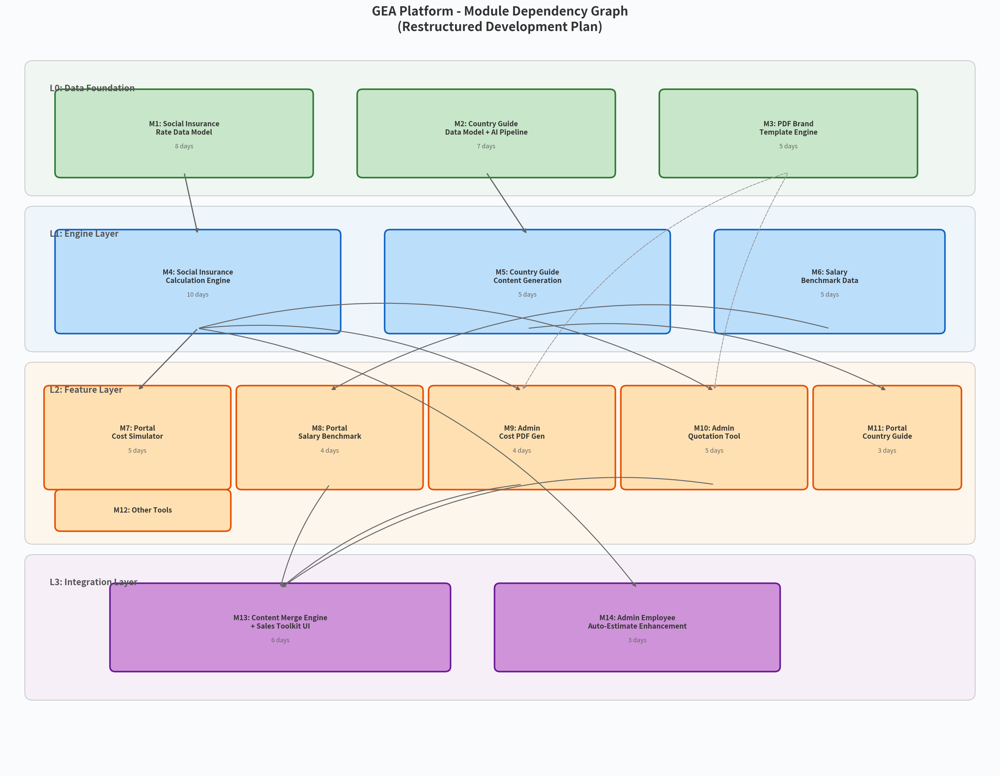
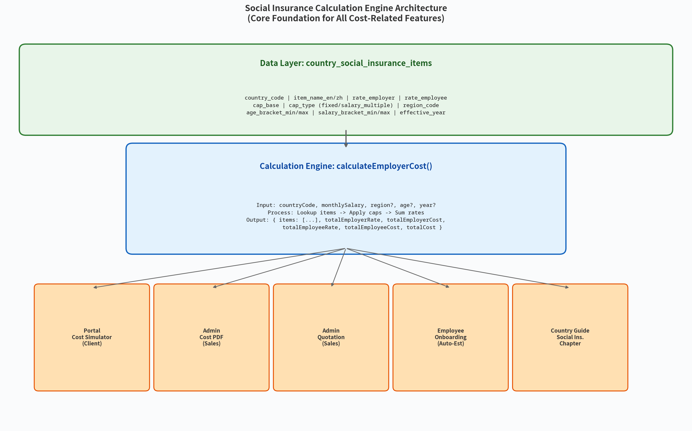
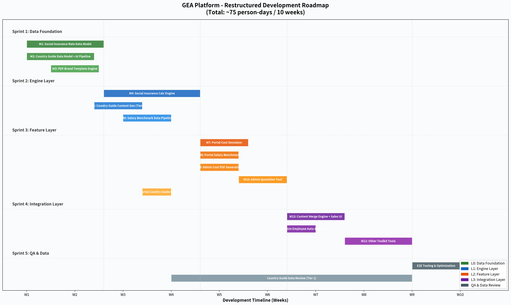

# GEA 平台功能扩展 — 整合需求文档与开发流程文档

**项目**：BEST GEA Platform  
**版本**：v2.0（重构版）  
**日期**：2026年3月3日  
**作者**：Manus AI  

---

## 一、文档概述

本文档是对今日所有需求讨论的全面重构和整合。在深入研究 GEA 项目代码后，我发现了一个此前被忽视的关键事实：**GEA 系统目前不具备任何自动化的社保成本计算能力**。`countries_config` 表中没有社保费率字段，`employees` 表中的 `estimatedEmployerCost` 完全依赖人工手动填写，`payrollItems` 中的 `employerSocialContribution` 和 `socialSecurityDeduction` 同样是人工输入。这意味着，**社保计算引擎不是一个"锦上添花"的功能，而是整个需求链的基石**——没有它，雇主成本模拟测算、报价工具、成本 PDF 生成等功能都无法实现自动化。

基于这一发现，本文档重新梳理了所有需求的真实依赖关系，将其拆分为 14 个模块、4 个层级，并设计了一条从数据基础到集成交付的完整开发路径。

---

## 二、现状诊断：为什么需要重构需求

### 2.1 现有系统中"成本计算"的真实状态

通过代码审计，确认以下事实：

**employees.estimatedEmployerCost** 字段的实际用途和数据来源：

| 维度 | 现状 |
|------|------|
| 数据类型 | `text`，默认值 `"0"` |
| 输入方式 | Admin 添加员工时**手动填写** |
| 前端标签 | "预估雇主成本（月）" |
| 前端描述 | "预估雇主社保、保险等成本，用于押金计算" |
| 核心用途 | 计算 deposit = (baseSalary + estimatedEmployerCost) × depositMultiplier |
| 自动计算 | **无** |

**payrollItems 中的社保字段**同样是手动输入：

```typescript
// server/routers/payroll.ts - calculateItemTotals()
// 所有字段都是从前端表单直接传入，没有任何自动计算逻辑
const socialSecurityDeduction = parseFloat(data.socialSecurityDeduction ?? "0");
const employerSocialContribution = parseFloat(data.employerSocialContribution ?? "0");
const totalEmploymentCost = gross + employerSocialContribution + reimbursements;
```

**countries_config 表中没有社保费率字段**。代码注释明确写道：

> Tax rates removed - not fixed values, handled per payroll run

这意味着当前系统的设计哲学是"社保费率太复杂，不做自动计算，交给人工处理"。这在早期是合理的，但随着 Toolkit、报价工具和 PDF 生成等需求的引入，手动输入已无法满足业务需求。

### 2.2 成本测算 Excel 揭示的真实计算模型

通过分析用户提供的越南成本测算 Excel，还原出完整的计算模型：

**Sheet 1（雇主社保成本测算）**：

| 项目 | 费率 | 金额 (VND) | 金额 (USD) |
|------|------|-----------|-----------|
| Social Insurance (BHXH) | 17.5% | 8,190,000 | 311.22 |
| Health Insurance (BHYT) | 3.0% | 1,404,000 | 53.35 |
| Unemployment Insurance (BHTN) | 1.0% | 600,000 | 22.80 |
| Trade Union Fee | 2.0% | 1,200,000 | 45.60 |
| **Total Social Security Cost** | **23.5%** | **11,394,000** | **432.97** |

每个项目都有独立的封顶基数规则（如 BHXH/BHYT 封顶 46,800,000 VND/月，BHTN 封顶 93,600,000 VND/月），且封顶基数因区域最低工资不同而不同。

**Sheet 2（用工总成本）** 的完整公式为：

```
月度费用 = 工资 + 强制福利(23.5%) + EOR服务费($249) + 差补 + 报销 + VAT + 转汇费 + 银行手续费
首月额外 = 履约保障金 + 签证费 + VAT + 银行手续费
季度费用 = 月度费用 × 3 + 季度bonus
```

这个计算模型目前完全在 Excel 中手动完成，没有任何系统化实现。

---

## 三、需求重构：14 个模块 × 4 个层级

### 3.1 模块依赖全景图



所有需求被重新拆分为 14 个模块，按依赖关系组织为 4 个层级：

| 层级 | 定位 | 模块 | 核心交付物 |
|------|------|------|-----------|
| **L0: Data Foundation** | 数据基础设施 | M1, M2, M3 | 社保费率表、Country Guide 数据模型、PDF 模板引擎 |
| **L1: Engine Layer** | 计算与内容引擎 | M4, M5, M6 | 社保计算引擎、Country Guide 内容、薪酬基准数据 |
| **L2: Feature Layer** | 面向用户的功能 | M7–M12 | Portal Toolkit、Admin 工具、Country Guide 展示 |
| **L3: Integration Layer** | 跨模块集成 | M13, M14 | 内容合并引擎、员工自动预估增强 |

**关键依赖链**：M1 → M4 → M7/M9/M10/M14 是整个需求链的主干。社保费率数据模型（M1）是社保计算引擎（M4）的前提，而计算引擎又是成本模拟器（M7）、成本 PDF（M9）、报价工具（M10）和员工自动预估（M14）的共同依赖。

---

## 四、M1：社保费率数据模型（L0 — 最高优先级）

### 4.1 为什么这是第一优先级

社保费率数据是整个需求链的源头。没有结构化的费率数据，计算引擎无法运行，所有下游功能都无法实现。当前系统中 `countries_config` 表刻意回避了这一复杂性（注释："Tax rates removed"），但现在必须正面解决。

### 4.2 数据模型设计

需要新建 `country_social_insurance_items` 表，存储每个国家的每个社保项目的详细费率规则：

```typescript
export const countrySocialInsuranceItems = sqliteTable(
  "country_social_insurance_items",
  {
    id: integer("id").primaryKey({ autoIncrement: true }),
    countryCode: text("countryCode", { length: 3 }).notNull(),
    
    // 项目标识
    itemKey: text("itemKey", { length: 50 }).notNull(),     // e.g. "bhxh", "bhyt", "cpf_ordinary"
    itemNameEn: text("itemNameEn", { length: 200 }).notNull(),
    itemNameZh: text("itemNameZh", { length: 200 }).notNull(),
    category: text("category", { enum: [
      "social_insurance",    // 社会保险
      "health_insurance",    // 医疗保险
      "unemployment",        // 失业保险
      "pension",             // 养老金
      "work_injury",         // 工伤保险
      "housing_fund",        // 住房公积金
      "trade_union",         // 工会费
      "other_mandatory",     // 其他强制缴纳
    ] }).notNull(),
    
    // 费率
    rateEmployer: text("rateEmployer").default("0").notNull(),   // 雇主费率 (如 0.175 = 17.5%)
    rateEmployee: text("rateEmployee").default("0").notNull(),   // 雇员费率
    
    // 封顶基数规则
    capType: text("capType", { enum: [
      "none",                // 无封顶
      "fixed_amount",        // 固定金额封顶 (如 46,800,000 VND)
      "salary_multiple",     // 最低工资倍数封顶 (如 20×区域最低工资)
      "bracket",             // 分档费率 (如新加坡CPF按年龄分档)
    ] }).default("none").notNull(),
    capBase: text("capBase"),          // 封顶基数金额 (fixed_amount时使用)
    capMultiplier: text("capMultiplier"), // 倍数 (salary_multiple时使用)
    capReferenceBase: text("capReferenceBase"), // 参考基数 (如 "regional_minimum_wage")
    
    // 条件维度
    regionCode: text("regionCode"),    // 区域编码 (如越南 Zone 1-4, 中国各城市)
    regionName: text("regionName"),    // 区域名称
    ageBracketMin: integer("ageBracketMin"), // 年龄下限 (新加坡CPF按年龄分档)
    ageBracketMax: integer("ageBracketMax"), // 年龄上限
    salaryBracketMin: text("salaryBracketMin"), // 薪资下限 (部分国家按薪资分档)
    salaryBracketMax: text("salaryBracketMax"), // 薪资上限
    
    // 版本控制
    effectiveYear: integer("effectiveYear").notNull(),  // 生效年份
    effectiveFrom: text("effectiveFrom"),               // 精确生效日期 (如年中调整)
    effectiveTo: text("effectiveTo"),                   // 失效日期
    
    // 法规引用
    legalReference: text("legalReference"),  // 法规编号 (如 "Decree No 38/2022/ND-CP")
    notes: text("notes"),                    // 备注说明
    
    // 排序和元数据
    sortOrder: integer("sortOrder").default(0).notNull(),
    isActive: integer("isActive", { mode: "boolean" }).default(true).notNull(),
    createdAt: integer("createdAt", { mode: "timestamp" }).defaultNow().notNull(),
    updatedAt: integer("updatedAt", { mode: "timestamp" }).defaultNow().$onUpdate(() => new Date()).notNull(),
  },
  (table) => ({
    countryYearIdx: index("csi_country_year_idx").on(table.countryCode, table.effectiveYear),
    countryItemIdx: index("csi_country_item_idx").on(table.countryCode, table.itemKey),
  })
);
```

### 4.3 为什么需要这么多字段

各国社保制度的复杂性远超"一个费率百分比"的简单模型。以下是 Tier 1 国家的典型复杂度：

| 国家 | 社保项目数 | 封顶规则 | 特殊维度 | 复杂度 |
|------|-----------|---------|---------|--------|
| 越南 | 4 项 | 固定金额 + 最低工资倍数 | 4 个区域 | 中 |
| 中国大陆 | 5 项 + 住房公积金 | 各城市不同 | 300+ 城市 | 极高 |
| 新加坡 | 1 项 (CPF) | 按年龄分 4 档 | 年龄 + PR/Citizen | 高 |
| 日本 | 5 项 | 按薪资等级 | 年龄 + 都道府县 | 高 |
| 韩国 | 4 项 | 固定封顶 | 无区域差异 | 低 |
| 泰国 | 1 项 (SSF) | 固定封顶 | 无 | 低 |
| 香港 | 1 项 (MPF) | 固定封顶 | 无 | 低 |
| 台湾 | 3 项 | 固定封顶 | 无 | 低 |
| 印尼 | 4 项 | 固定封顶 | 无 | 中 |
| 马来西亚 | 3 项 (EPF/SOCSO/EIS) | 按薪资分档 | 无 | 中 |
| 美国 | 3 项 (FICA/FUTA/SUI) | 固定封顶 | 50 个州 | 高 |

**中国大陆**是复杂度最高的国家。五险一金的费率和基数因城市而异（北京、上海、深圳的费率都不同），且每年 7 月调整。初期建议仅覆盖一线城市（北京、上海、广州、深圳），后续逐步扩展。

### 4.4 Admin 管理界面

在 Admin 后台的 Settings 或独立的 "Social Insurance Config" 页面中，提供：

1. **国家列表视图**：显示每个国家已配置的社保项目数、最后更新时间、生效年份
2. **国家详情编辑器**：按项目逐条编辑费率、封顶规则、区域差异
3. **批量导入**：支持 CSV/Excel 批量导入费率数据（参照现有成本测算 Excel 的格式）
4. **AI 辅助填充**：调用 AI Gateway 从公开数据源抓取并预填费率数据，人工审核确认
5. **版本管理**：按年份管理费率版本，支持提前配置下一年度费率

### 4.5 工作量估算：8 个工作日

| 子任务 | 工作日 |
|--------|--------|
| 数据模型设计 + Schema 迁移 | 1 |
| Admin CRUD 路由 (含批量导入) | 2 |
| Admin 管理页面 (列表 + 编辑器) | 3 |
| Tier 1 国家初始数据录入 (11国) | 1.5 |
| 单元测试 | 0.5 |

---

## 五、M4：社保计算引擎（L1 — 核心引擎）

### 5.1 引擎架构



计算引擎是一个纯函数服务，输入国家代码和薪资参数，输出结构化的社保成本明细。它是 5 个下游功能的共同依赖。

### 5.2 核心接口设计

```typescript
// server/services/socialInsuranceCalcService.ts

interface CalcInput {
  countryCode: string;
  monthlySalary: number;
  salaryCurrency: string;
  region?: string;        // 区域编码 (越南Zone/中国城市/美国州)
  employeeAge?: number;   // 年龄 (新加坡CPF/日本厚生年金)
  effectiveYear?: number; // 计算年份，默认当前年
}

interface CalcItemResult {
  itemKey: string;
  itemNameEn: string;
  itemNameZh: string;
  category: string;
  rateEmployer: number;
  rateEmployee: number;
  amountEmployer: number;  // 实际缴纳金额 (已应用封顶)
  amountEmployee: number;
  capApplied: boolean;     // 是否触发了封顶
  capBase?: number;        // 实际使用的封顶基数
  legalReference?: string;
}

interface CalcResult {
  countryCode: string;
  monthlySalary: number;
  currency: string;
  effectiveYear: number;
  items: CalcItemResult[];
  
  // 汇总
  totalEmployerRate: number;     // 雇主总费率 (未封顶的名义费率)
  totalEmployerCost: number;     // 雇主总成本 (已封顶的实际金额)
  totalEmployeeRate: number;
  totalEmployeeCost: number;
  totalSocialCost: number;       // 雇主 + 雇员
  totalEmploymentCost: number;   // 月薪 + 雇主社保
  
  // 元数据
  region?: string;
  warnings: string[];            // 如 "封顶基数已触发", "区域未指定，使用默认"
}

async function calculateSocialInsurance(input: CalcInput): Promise<CalcResult>;
```

### 5.3 计算逻辑详解

计算引擎的核心流程为：

**Step 1: 查询适用的社保项目**。根据 `countryCode`、`effectiveYear`、`region`（如有）、`age`（如有）从 `country_social_insurance_items` 表中查询所有匹配的活跃项目。

**Step 2: 逐项计算**。对每个社保项目，根据其 `capType` 应用不同的封顶逻辑：

```typescript
function calculateItemAmount(
  salary: number, 
  rate: number, 
  capType: string, 
  capBase?: number,
  capMultiplier?: number,
  referenceBase?: number // 区域最低工资等
): { amount: number; capApplied: boolean; actualCapBase?: number } {
  
  switch (capType) {
    case "none":
      return { amount: salary * rate, capApplied: false };
      
    case "fixed_amount":
      // 缴费基数不超过封顶金额
      const cappedBase1 = Math.min(salary, capBase!);
      return { 
        amount: cappedBase1 * rate, 
        capApplied: salary > capBase!,
        actualCapBase: capBase 
      };
      
    case "salary_multiple":
      // 封顶基数 = 参考基数 × 倍数
      const capAmount = (referenceBase ?? 0) * (capMultiplier ?? 1);
      const cappedBase2 = Math.min(salary, capAmount);
      return { 
        amount: cappedBase2 * rate, 
        capApplied: salary > capAmount,
        actualCapBase: capAmount 
      };
      
    case "bracket":
      // 分档费率：直接使用该档位的费率（已在数据层按条件筛选）
      return { amount: salary * rate, capApplied: false };
      
    default:
      return { amount: salary * rate, capApplied: false };
  }
}
```

**Step 3: 汇总输出**。将所有项目的计算结果汇总，输出结构化的 `CalcResult`。

### 5.4 越南案例验证

以用户提供的越南成本测算 Excel 为基准，验证计算引擎的正确性：

| 输入 | 值 |
|------|-----|
| countryCode | VN |
| monthlySalary | 60,000,000 VND |
| region | zone_1 (河内/胡志明市) |

| 项目 | 费率 | capType | capBase | 计算过程 | 金额 |
|------|------|---------|---------|---------|------|
| BHXH | 17.5% | fixed_amount | 46,800,000 | min(60M, 46.8M) × 17.5% | 8,190,000 |
| BHYT | 3.0% | fixed_amount | 46,800,000 | min(60M, 46.8M) × 3% | 1,404,000 |
| BHTN | 1.0% | salary_multiple | 20× | min(60M, 4.68M×20) × 1% | 600,000 |
| Trade Union | 2.0% | none | - | 60M × 2% | 1,200,000 |
| **Total** | | | | | **11,394,000** |

计算结果与 Excel 完全一致，验证通过。

### 5.5 中国大陆的特殊处理

中国大陆的社保计算是所有国家中最复杂的，需要特别设计：

**五险一金**的费率因城市而异。以 2025 年为例：

| 项目 | 北京(雇主) | 上海(雇主) | 深圳(雇主) |
|------|-----------|-----------|-----------|
| 养老保险 | 16% | 16% | 16% |
| 医疗保险 | 9.8% | 9.5% | 5.2% |
| 失业保险 | 0.5% | 0.5% | 0.7% |
| 工伤保险 | 0.2%-1.9% | 0.16%-1.52% | 0.14%-1.4% |
| 生育保险 | 已并入医疗 | 已并入医疗 | 0.45% |
| 住房公积金 | 5%-12% | 5%-7% | 5%-12% |

**处理方案**：在 `country_social_insurance_items` 表中，为中国大陆的每个城市创建独立的记录集（通过 `regionCode` 区分）。初期覆盖北京、上海、广州、深圳四个一线城市，后续按需扩展。工伤保险费率因行业而异，建议使用中间值或允许用户在模拟测算时手动调整。

### 5.6 工作量估算：10 个工作日

| 子任务 | 工作日 |
|--------|--------|
| 核心计算函数 + 封顶逻辑 | 3 |
| Tier 1 国家计算规则实现 (11国) | 4 |
| tRPC 路由封装 (供前后端调用) | 1 |
| 单元测试 (每国至少 3 个用例) | 2 |

---

## 六、M2 + M5：Country Guide 模块（L0 + L1）

### 6.1 数据模型（M2，7 天）

Country Guide 作为 Knowledge Base 的新分类融入现有架构。需要新建两张表：

**countryGuideChapters**：存储结构化的章节内容（参照越南 Country Guide 的 46 个章节结构）。

```typescript
export const countryGuideChapters = sqliteTable(
  "country_guide_chapters",
  {
    id: integer("id").primaryKey({ autoIncrement: true }),
    countryCode: text("countryCode", { length: 3 }).notNull(),
    part: integer("part").notNull(),           // 1=雇佣指南, 2=营商拓展指南
    chapterKey: text("chapterKey", { length: 50 }).notNull(),
    titleEn: text("titleEn", { length: 300 }).notNull(),
    titleZh: text("titleZh", { length: 300 }).notNull(),
    contentEn: text("contentEn").notNull(),    // Markdown 格式
    contentZh: text("contentZh").notNull(),
    sortOrder: integer("sortOrder").default(0).notNull(),
    version: text("version", { length: 20 }).notNull(),  // e.g. "2026-Q1"
    status: text("status", { enum: ["draft", "review", "published", "archived"] })
      .default("draft").notNull(),
    metadata: text("metadata", { mode: "json" }),  // 额外结构化数据 (如税率表JSON)
    effectiveFrom: text("effectiveFrom"),
    effectiveTo: text("effectiveTo"),
    createdAt: integer("createdAt", { mode: "timestamp" }).defaultNow().notNull(),
    updatedAt: integer("updatedAt", { mode: "timestamp" }).defaultNow().$onUpdate(() => new Date()).notNull(),
  }
);
```

**countryGuideVersions**：管理每个国家的 Country Guide 版本（支持季度/半年度更新，定稿后当年不再更新）。

### 6.2 AI 辅助生成 Pipeline（M5，5 天）

复用现有 `knowledgeAiService.ts` 的 `executeTaskLLM` 函数，为每个章节设计专用 Prompt 模板。生成流程为：

1. Admin 选择目标国家 → 触发批量生成
2. 系统按章节逐个调用 AI Gateway，传入国家名称 + 章节模板 + 参考数据源
3. AI 生成中英双语初稿 → 存入 `countryGuideChapters`（status = "draft"）
4. 人工审核 → 修改 → 发布（status = "published"）

**关键设计决策**：AI 生成的社保章节（Part 1: Contributions）应当直接引用 `country_social_insurance_items` 表中的结构化数据，而非让 AI 自由生成费率数字。这确保了 Country Guide 中的社保数据与计算引擎使用的数据完全一致。

### 6.3 更新频率管理

用户明确要求：季度/半年度更新，一旦定稿在当前自然年内不再更新。实现方案：

- 每个版本有 `version` 标识（如 "2026-Q1"）和 `status` 状态
- 发布后 status 变为 "published"，前端只展示 published 版本
- 新一轮更新时，复制当前版本为 "draft"，编辑后发布，旧版本自动归档为 "archived"
- 同一自然年内，已发布的版本不可编辑（需要管理员强制解锁）

---

## 七、M3：PDF 品牌模板引擎（L0）

### 7.1 设计目标

基于对四份参考文件（Country Guide、成本测算、报价单、公司介绍）的分析，PDF 品牌模板引擎需要提供统一的品牌视觉系统，供所有 PDF 生成功能复用。

### 7.2 品牌要素提取

| 要素 | 规格 | 来源 |
|------|------|------|
| Logo | GEA Logo（左上）+ CGL 出海服务 Logo（右上） | 公司介绍 PDF |
| 品牌色 | 深绿 (#1B5E20) + 金黄 (#D4A017) + 米色背景 (#FFF8E1) | Country Guide 封面 |
| 字体 | Noto Sans SC（中英混排） | 已有 CDN 缓存方案 |
| 页眉 | Logo + 分隔线 | 报价单 PDF |
| 页脚 | 页码 + 公司地址 + 联系方式 | 报价单 PDF |
| 封面 | 国家名称大字 + 标志性图片 + 菱形几何装饰 | Country Guide 封面 |

### 7.3 技术实现

在 `server/services/` 下新建 `pdfBrandTemplateService.ts`，封装以下可复用函数：

```typescript
// 品牌模板引擎 API
function createBrandedPdf(options?: { pageSize?: string }): PDFDocument;
function addCoverPage(doc: PDFDocument, options: CoverPageOptions): void;
function addHeaderFooter(doc: PDFDocument, pageNum: number, totalPages: number): void;
function addSectionTitle(doc: PDFDocument, titleEn: string, titleZh: string): void;
function addTable(doc: PDFDocument, headers: string[], rows: string[][]): void;
function addMarkdownContent(doc: PDFDocument, markdown: string): void;
```

### 7.4 工作量估算：5 个工作日

复用现有 `invoicePdfService.ts` 的 PDFKit + CJK 字体方案，主要工作在品牌模板设计和 Markdown 渲染。

---

## 八、M7 + M8：Client Portal Toolkit（L2）

### 8.1 Portal 侧边栏扩展

在现有 `PortalLayout.tsx` 的 `buildPortalNavGroups()` 中新增 "Toolkit" 导航组：

```typescript
{
  labelKey: "nav.toolkit",
  items: [
    { labelKey: "nav.costSimulator", icon: Calculator, href: portalPath("/toolkit/cost-simulator") },
    { labelKey: "nav.salaryBenchmark", icon: BarChart3, href: portalPath("/toolkit/salary-benchmark") },
    // 后续扩展
    // { labelKey: "nav.complianceCalendar", icon: CalendarCheck, href: portalPath("/toolkit/compliance-calendar") },
    // { labelKey: "nav.netPayCalculator", icon: Wallet, href: portalPath("/toolkit/net-pay-calculator") },
  ],
}
```

### 8.2 M7：雇主成本模拟测算工具（5 天）

**用户交互流程**：

1. 选择国家（从 `countries_config` 中 `isActive=true` 的国家列表）
2. 输入月薪金额和币种
3. 选择区域（如适用，如越南的 Zone 1-4）
4. 点击"计算" → 调用 M4 社保计算引擎
5. 展示结构化结果：社保明细表 + 总成本汇总 + 可视化图表

**后端路由**：在 `server/portal/routers/` 下新建 `portalToolkitRouter.ts`：

```typescript
portalToolkit: router({
  simulateCost: portalProtectedProcedure
    .input(z.object({
      countryCode: z.string(),
      monthlySalary: z.number(),
      salaryCurrency: z.string(),
      region: z.string().optional(),
      employeeAge: z.number().optional(),
    }))
    .query(async ({ input }) => {
      // 调用 M4 社保计算引擎
      const socialInsurance = await calculateSocialInsurance(input);
      // 查询 EOR 服务费
      const eorRate = await getStandardEorRate(input.countryCode);
      // 查询汇率
      const exchangeRate = await getExchangeRate(input.salaryCurrency, "USD");
      
      return {
        socialInsurance,
        eorServiceFee: eorRate,
        exchangeRate,
        totalMonthlyCost: socialInsurance.totalEmploymentCost + eorRate,
      };
    }),
})
```

**前端页面**：`client/src/pages/portal/PortalCostSimulator.tsx`，包含输入表单、结果表格和 Recharts 可视化图表（饼图展示成本构成、柱状图对比不同国家）。

### 8.3 M8：全球薪酬 Benchmark 工具（4 天）

**数据来源策略**：薪酬 Benchmark 数据不在现有数据库中，需要新建数据表并通过以下方式填充：

1. **初期**：Admin 手动录入或 CSV 导入（参考 Mercer、WageIndicator 等公开数据）
2. **中期**：AI 辅助从公开数据源抓取并结构化
3. **长期**：接入第三方薪酬数据 API

**数据模型**：

```typescript
export const salaryBenchmarks = sqliteTable(
  "salary_benchmarks",
  {
    id: integer("id").primaryKey({ autoIncrement: true }),
    countryCode: text("countryCode", { length: 3 }).notNull(),
    jobCategory: text("jobCategory", { length: 100 }).notNull(),
    jobTitle: text("jobTitle", { length: 200 }).notNull(),
    seniorityLevel: text("seniorityLevel", { enum: ["junior", "mid", "senior", "lead", "director"] }).notNull(),
    salaryP25: text("salaryP25").notNull(),   // 25th percentile
    salaryP50: text("salaryP50").notNull(),   // Median
    salaryP75: text("salaryP75").notNull(),   // 75th percentile
    currency: text("currency", { length: 3 }).notNull(),
    dataYear: integer("dataYear").notNull(),
    source: text("source"),
    updatedAt: integer("updatedAt", { mode: "timestamp" }).defaultNow().notNull(),
  }
);
```

**前端页面**：`client/src/pages/portal/PortalSalaryBenchmark.tsx`，提供国家+职位+级别的筛选器，展示薪酬分位数对比图表。

---

## 九、M9 + M10：Admin 销售工具（L2）

### 9.1 M9：Admin 雇主成本测算 PDF 生成（4 天）

与 Portal 端的 M7 共享同一个计算引擎（M4），但增加以下 Admin 专属能力：

- 可为 Lead 或 Customer 生成（关联 `salesLeads` 或 `customers` 表）
- 生成品牌化 PDF（调用 M3 品牌模板引擎）
- 可勾选合并对应国家的 Country Guide
- PDF 上传 S3 并记录到新建的 `salesDocuments` 表

### 9.2 M10：Admin 报价工具（5 天）

**数据模型**：新建 `quotations` 表：

```typescript
export const quotations = sqliteTable(
  "quotations",
  {
    id: integer("id").primaryKey({ autoIncrement: true }),
    quotationNumber: text("quotationNumber", { length: 50 }).notNull().unique(),
    leadId: integer("leadId"),
    customerId: integer("customerId"),
    
    // 报价内容 (JSON)
    countries: text("countries", { mode: "json" }),  // [{countryCode, tier, headcount, unitPrice, serviceType}]
    totalMonthly: text("totalMonthly").notNull(),
    currency: text("currency", { length: 3 }).default("USD").notNull(),
    validUntil: text("validUntil"),
    
    // 状态
    status: text("status", { enum: ["draft", "sent", "accepted", "expired", "rejected"] })
      .default("draft").notNull(),
    
    // PDF
    pdfUrl: text("pdfUrl"),
    pdfKey: text("pdfKey"),
    
    // 发送记录
    sentAt: integer("sentAt", { mode: "timestamp" }),
    sentTo: text("sentTo"),
    sentBy: integer("sentBy"),
    
    createdBy: integer("createdBy").notNull(),
    createdAt: integer("createdAt", { mode: "timestamp" }).defaultNow().notNull(),
    updatedAt: integer("updatedAt", { mode: "timestamp" }).defaultNow().$onUpdate(() => new Date()).notNull(),
  }
);
```

**定价自动计算逻辑**：

```
对于每个国家：
  1. 查询 customer_pricing 中该 Lead/Customer 的专属定价
  2. 如无专属定价，使用 countries_config.standardEorRate (标准价)
  3. 如有人数折扣规则，按人数档位应用折扣
  
总报价 = Σ(各国人数 × 对应单价)
```

**Lead 转 Customer 定价沿用**：当 `salesLeads.status` 变为 `msa_signed` 且 `convertedCustomerId` 被设置时，系统自动将该 Lead 的 `customer_pricing` 记录复制到新 Customer 下。

---

## 十、M13：内容合并引擎 + 销售工具包 UI（L3）

### 10.1 合并引擎设计

这是整个销售工具包的核心能力。销售在 Admin 后台可以自主选择多个内容模块，合并生成一份品牌化 PDF。

**可选模块清单**：

| 模块类型 | 数据来源 | 生成方式 |
|---------|---------|---------|
| `company_profile` | 预设模板 (S3) | 静态 PDF 片段 |
| `quotation` | quotations 表 | 动态生成 |
| `cost_simulation` | M4 计算引擎 | 动态生成 |
| `salary_benchmark` | salaryBenchmarks 表 | 动态生成 |
| `country_guide` | countryGuideChapters 表 | 按章节选择性生成 |
| `kb_article` | knowledgeItems 表 | 动态生成 |

**合并流程**：

```
销售选择 Lead/Customer
  → 选择要包含的模块（拖拽排序）
  → 配置每个模块的参数（如国家、职位等）
  → 预览 → 生成 PDF
  → 上传 S3 → 记录到 salesDocuments
  → 可选：通过邮件发送给客户
```

### 10.2 PDF 合并技术方案

推荐使用 `pdf-lib`（轻量级 PDF 操作库，无需 C++ 依赖）进行 PDF 合并：

```typescript
import { PDFDocument } from "pdf-lib";

async function mergePdfBuffers(buffers: Buffer[]): Promise<Buffer> {
  const merged = await PDFDocument.create();
  for (const buffer of buffers) {
    const source = await PDFDocument.load(buffer);
    const pages = await merged.copyPages(source, source.getPageIndices());
    pages.forEach(page => merged.addPage(page));
  }
  return Buffer.from(await merged.save());
}
```

每个模块独立生成 PDF Buffer（使用 PDFKit + M3 品牌模板），最后通过 `pdf-lib` 合并。这种方案的优势是模块完全解耦，可以独立测试和复用。

### 10.3 工作量估算：6 个工作日

| 子任务 | 工作日 |
|--------|--------|
| 合并引擎核心逻辑 | 2 |
| 销售工具包 UI (模块选择 + 拖拽排序 + 预览) | 2.5 |
| 邮件发送集成 | 1 |
| 测试 | 0.5 |

---

## 十一、M14：Admin 员工自动预估增强（L3）

### 11.1 改造目标

将现有的手动填写 `estimatedEmployerCost` 改为自动计算 + 手动覆盖的混合模式。

### 11.2 实现方案

在 Admin 添加/编辑员工页面中：

1. 当用户选择国家和输入月薪后，自动调用 M4 计算引擎
2. 将计算结果预填到 `estimatedEmployerCost` 字段
3. 用户可以手动修改（覆盖自动计算值）
4. 如果用户未修改，使用自动计算值

**代码改动点**：

- `client/src/pages/Employees.tsx`：在国家/薪资变化时调用 tRPC 查询
- `server/routers/employees.ts`：新增 `estimateCost` 查询路由
- 不影响现有的 deposit 计算逻辑（仍然使用 `estimatedEmployerCost` 字段）

### 11.3 工作量估算：3 个工作日

---

## 十二、其他 Toolkit 工具（M12，L2/L3）

### 12.1 建议的扩展工具

基于 EOR/PEO 行业最佳实践和客户需求分析，建议在后续迭代中增加以下工具：

| 工具 | 优先级 | 依赖 | 预估工作日 | 客户价值 |
|------|--------|------|-----------|---------|
| 合规日历 & 提醒 | P1 | countries_config + leaveTypes | 4 | 避免合规风险 |
| 税后到手薪酬计算器 | P1 | M4 (雇员侧费率) | 3 | 员工体验 |
| EOR vs 自建实体对比 | P2 | 静态内容 + M4 | 3 | 辅助决策 |
| 全球福利对比 | P2 | Country Guide 数据 | 2 | 信息透明 |
| 用工风险自检清单 | P2 | 静态内容 | 2 | 合规意识 |
| AI 合规问答助手 | P3 | Copilot 框架 + KB | 5 | 即时支持 |

这些工具可以在核心功能（M1-M14）交付后，按优先级逐步实现。

---

## 十三、开发路线图

### 13.1 总览



### 13.2 五个 Sprint 详细计划

**Sprint 1: Data Foundation（W1-W2，20 天）**

三个 L0 模块可以并行开发，因为它们之间没有依赖关系。

| 模块 | 开发者 | 时间 | 交付物 |
|------|--------|------|--------|
| M1: 社保费率数据模型 | Dev A | W1-W2 (8天) | Schema + Admin CRUD + Tier 1 数据 |
| M2: Country Guide 数据模型 | Dev B | W1-W2 (7天) | Schema + Admin 编辑器 + AI Pipeline |
| M3: PDF 品牌模板引擎 | Dev C | W1 (5天) | 模板函数 + 品牌资产 |

**Sprint 2: Engine Layer（W3-W4，20 天）**

M4 依赖 M1，M5 依赖 M2，M6 独立。

| 模块 | 开发者 | 时间 | 交付物 |
|------|--------|------|--------|
| M4: 社保计算引擎 | Dev A | W3-W4 (10天) | 计算函数 + 11国规则 + 测试 |
| M5: Country Guide 内容生成 | Dev B | W3 (5天) | Tier 1 国家 AI 初稿 |
| M6: 薪酬 Benchmark 数据 | Dev C | W3-W4 (5天) | 数据表 + 导入工具 + 初始数据 |

**Sprint 3: Feature Layer（W5-W6，21 天）**

所有 L2 模块依赖 L1 层的引擎。

| 模块 | 开发者 | 时间 | 交付物 |
|------|--------|------|--------|
| M7: Portal 成本模拟器 | Dev A | W5 (5天) | 页面 + 路由 + 图表 |
| M8: Portal 薪酬 Benchmark | Dev B | W5 (4天) | 页面 + 路由 + 对比图表 |
| M9: Admin 成本 PDF | Dev C | W5 (4天) | PDF 生成 + 路由 |
| M10: Admin 报价工具 | Dev A | W6 (5天) | 报价 CRUD + PDF + 定价计算 |
| M11: Portal Country Guide | Dev B | W4 (3天) | 国家列表 + 详情页 + PDF 下载 |

**Sprint 4: Integration Layer（W7-W8，16 天）**

| 模块 | 开发者 | 时间 | 交付物 |
|------|--------|------|--------|
| M13: 内容合并引擎 + 销售 UI | Dev A+C | W7 (6天) | 合并引擎 + 模块选择 UI + 邮件 |
| M14: 员工自动预估增强 | Dev B | W7 (3天) | 自动计算 + 手动覆盖 |
| M12: 其他 Toolkit 工具 | Dev B+C | W8 (7天) | 合规日历 + 税后计算器 |

**Sprint 5: QA & Data（W9-W10，8 天）**

| 任务 | 时间 | 说明 |
|------|------|------|
| E2E 测试 & 优化 | W9 (5天) | 全链路测试 + 性能优化 + Bug 修复 |
| Country Guide 数据审核 | W4-W8 (并行) | 合规团队审核 AI 生成的 Tier 1 国家内容 |
| UAT 用户验收测试 | W10 (3天) | 销售团队 + 客户代表试用反馈 |

### 13.3 总工作量汇总

| 层级 | 模块 | 工作日 |
|------|------|--------|
| L0: Data Foundation | M1 + M2 + M3 | 20 |
| L1: Engine Layer | M4 + M5 + M6 | 20 |
| L2: Feature Layer | M7 + M8 + M9 + M10 + M11 | 21 |
| L3: Integration Layer | M12 + M13 + M14 | 16 |
| QA & Data | 测试 + 审核 | 8 |
| **总计** | | **约 85 人天 / 10 周** |

> 注：如果团队有 3 名开发者并行工作，关键路径为 M1 → M4 → M7/M10 → M13，约 29 天（6 周）。

---

## 十四、风险评估与缓解措施

| 风险 | 概率 | 影响 | 缓解措施 |
|------|------|------|---------|
| 各国社保规则复杂度超预期 | 高 | 高 | 优先实现简单国家（韩国、泰国、香港），复杂国家（中国、日本）后置 |
| 社保费率数据准确性 | 中 | 高 | 交叉验证（官方来源 + 四大会计师事务所数据），建立数据审核流程 |
| AI 生成 Country Guide 质量 | 中 | 中 | 多轮审核，人工兜底，参考竞品内容结构 |
| PDF 品牌模板还原度 | 低 | 中 | 提前与设计团队确认，迭代优化 |
| 中国大陆城市级费率维护成本 | 高 | 中 | 初期仅覆盖 4 个一线城市，后续按需扩展 |
| 薪酬 Benchmark 数据获取 | 中 | 中 | 初期使用公开数据 + 手动录入，长期接入第三方 API |

---

## 十五、总结

### 15.1 核心洞察

本次需求重构的最大发现是：**社保计算引擎是一个被低估的基础设施需求**。它不仅是 Toolkit 中"雇主成本模拟测算"工具的后端，更是报价工具、成本 PDF、员工入职预估、Country Guide 社保章节等 5 个功能的共同依赖。将其作为独立的基础设施模块优先建设，可以避免后续各功能模块重复实现计算逻辑，确保全平台数据一致性。

### 15.2 与之前方案的关键差异

| 维度 | 之前的方案 | 重构后的方案 |
|------|-----------|-------------|
| 社保计算 | 假设 countries_config 已有费率数据 | 明确识别为缺失，需从零建设 |
| 模块依赖 | 各功能相对独立 | 识别出 M1→M4 的关键依赖链 |
| 开发顺序 | Country Guide 优先 | 社保数据模型 + 计算引擎优先 |
| 工作量 | 44 人天 | 85 人天（增加了数据基础设施层） |
| 数据准确性 | 依赖 AI 生成 | 结构化数据 + AI 生成 + 人工审核 |

### 15.3 建议的 MVP 策略

如果资源有限，建议以下 MVP 路径（约 30 人天 / 6 周）：

1. **M1**（社保费率数据模型）→ 仅覆盖 3 个简单国家（香港、韩国、泰国）
2. **M4**（社保计算引擎）→ 仅实现 "none" 和 "fixed_amount" 两种封顶类型
3. **M7**（Portal 成本模拟器）→ 核心功能，无图表
4. **M14**（员工自动预估）→ 替代手动填写

这个 MVP 可以在 6 周内交付，验证计算引擎的可行性和客户价值，然后再扩展到全部 14 个模块。

---

*本文档基于 GEA 平台代码库（截至 2026 年 3 月 3 日）的深入审计和用户提供的四份参考文件。工作量估算基于单人全职开发的假设，实际工期因团队规模和并行度而调整。*
