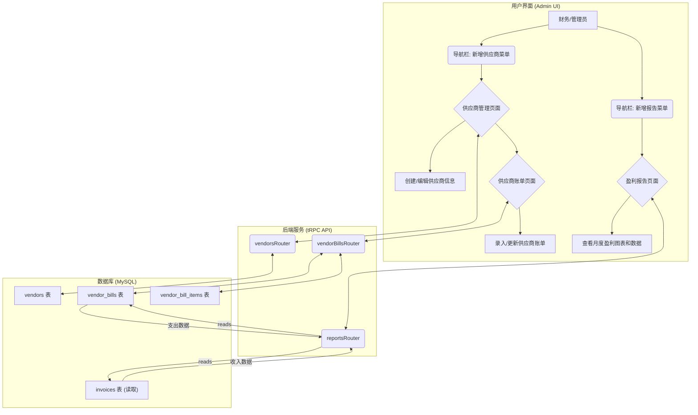

# 供应商管理与盈利报告功能设计方案

**作者:** Manus AI
**日期:** 2026年2月27日
**版本:** 1.0

## 1. 概述

本文档旨在为现有的GEA-EOR-SaaS Admin系统设计一个全新的 **供应商管理 (Vendor Management)** 功能模块。该模块的核心目标是追踪公司向全球供应商支付的各类款项，并与现有成熟的客户收款（Invoices）系统数据进行整合，最终实现月度 **盈利报告 (Profit & Loss Report)** 的自动化或半自动化生成。这将为公司的财务状况提供一个清晰、完整的视图，打通“收入”与“支出”两条主线。

## 2. 需求分析

通过对现有系统和用户需求的分析，我们将新功能分解为以下几个关键需求：

- **供应商信息管理:** 需要一个集中的地方来记录和管理所有供应商的基本信息，包括联系方式、合同、银行账户等。
- **供应商账单追踪:** 需要记录向供应商支付的每一笔款项（账单），包括金额、日期、支付状态、账单类型等。
- **数据对接:** 将新引入的“支出”（供应商账单）数据与现有的“收入”（客户发票）数据进行关联和匹配。
- **盈利报告生成:** 基于收入和支出数据，按月度生成盈利报告，报告需包含收入、支出、毛利等核心财务指标。
- **权限控制:** 确保只有具备相应权限的用户（如财务经理、管理员）才能访问和管理供应商及盈利报告数据。

## 3. 整体架构设计

我们将在现有技术栈（React, TypeScript, tRPC, Drizzle ORM, MySQL）的基础上进行扩展，确保新功能与现有系统无缝集成。整体设计遵循模块化原则，将新增三个核心模块：**供应商 (Vendors)**、**供应商账单 (Vendor Bills)** 和 **报告 (Reports)**。

### 3.1. 系统流程图



## 4. 数据库模型设计 (Schema)

我们将在 `drizzle/schema.ts` 文件中新增以下三张表来支持供应商管理功能。这将构成我们数据持久化的基础。

### 4.1. `vendors` (供应商表)

此表用于存储所有供应商的核心信息。

| 字段名 | 类型 | 描述 | 示例 |
| :--- | :--- | :--- | :--- |
| `id` | `int` (PK) | 唯一标识符 | 1 |
| `vendorCode` | `varchar(20)` | 供应商代码 (自动生成) | `VDR-000001` |
| `name` | `varchar(255)` | 供应商公司名称 | "Global Payroll Partner Inc." |
| `contactName` | `varchar(255)` | 主要联系人姓名 | "John Doe" |
| `contactEmail` | `varchar(320)` | 联系人邮箱 | "john.doe@gpp.com" |
| `contactPhone` | `varchar(50)` | 联系人电话 | "+1-202-555-0178" |
| `country` | `varchar(100)` | 供应商所在国家 | "USA" |
| `address` | `text` | 详细地址 | "123 Innovation Drive, Suite 456" |
| `serviceType` | `varchar(100)` | 服务类型 | "Payroll Processing" |
| `status` | `enum('active', 'inactive')` | 状态 | `active` |
| `bankDetails` | `text` | 银行账户信息（加密存储） | "Bank:..., Account:..." |
| `notes` | `text` | 内部备注 | "Primary partner for North America." |
| `createdAt` | `timestamp` | 创建时间 | `2026-02-27 10:00:00` |
| `updatedAt` | `timestamp` | 更新时间 | `2026-02-27 10:00:00` |

### 4.2. `vendor_bills` (供应商账单表)

此表用于记录付给供应商的每一笔款项，是计算“支出”的核心。

| 字段名 | 类型 | 描述 | 示例 |
| :--- | :--- | :--- | :--- |
| `id` | `int` (PK) | 唯一标识符 | 1 |
| `vendorId` | `int` (FK) | 关联的供应商ID | 1 |
| `billNumber` | `varchar(100)` | 账单号（可手动输入） | "INV-GPP-2026-01" |
| `billDate` | `date` | 账单日期 | `2026-01-31` |
| `dueDate` | `date` | 支付截止日期 | `2026-02-28` |
| `paidDate` | `date` | 实际支付日期 | `2026-02-25` |
| `currency` | `varchar(3)` | 支付货币 | `USD` |
| `totalAmount` | `decimal(15,2)` | 账单总金额 | `5000.00` |
| `status` | `enum('draft', 'submitted', 'paid', 'overdue')` | 账单状态 | `paid` |
| `category` | `varchar(100)` | 费用类别 | "Service Fee" |
| `description` | `text` | 账单描述 | "Jan 2026 Payroll Services - USA" |
| `receiptFileUrl` | `text` | 收据/发票文件URL | "https://.../receipt.pdf" |
| `receiptFileKey` | `varchar(500)` | 文件在S3中的Key | "receipts/....pdf" |
| `createdAt` | `timestamp` | 创建时间 | `2026-02-27 11:00:00` |
| `updatedAt` | `timestamp` | 更新时间 | `2026-02-27 11:00:00` |

### 4.3. `vendor_bill_items` (供应商账单明细表)

此表为可选项，但强烈建议实现，用于提供更详细的成本归集。例如，一张总账单可能包含为多个客户或多个国家提供的服务费用。

| 字段名 | 类型 | 描述 | 示例 |
| :--- | :--- | :--- | :--- |
| `id` | `int` (PK) | 唯一标识符 | 1 |
| `vendorBillId` | `int` (FK) | 关联的供应商账单ID | 1 |
| `description` | `varchar(500)` | 明细描述 | "Payroll for Customer A (5 employees)" |
| `amount` | `decimal(15,2)` | 明细金额 | `2500.00` |
| `relatedCustomerId` | `int` (FK, nullable) | 关联的客户ID | 101 |
| `relatedEmployeeId` | `int` (FK, nullable) | 关联的员工ID | 201 |
| `relatedCountryCode` | `varchar(3)` | 关联的国家代码 | "USA" |

## 5. 后端实现 (tRPC API)

我们将在 `server/routers` 目录下创建新的路由文件，并更新 `server/routers.ts` 来注册它们。

### 5.1. `vendorsRouter.ts`

此路由将提供对 `vendors` 表的CRUD操作，并使用 `customerManagerProcedure` 或更高级别的权限进行保护。

- `list`: 分页列出所有供应商，支持按名称、国家、状态搜索和筛选。
- `get`: 获取单个供应商的详细信息。
- `create`: 创建新的供应商，并自动生成 `vendorCode`。
- `update`: 更新现有供应商的信息。

### 5.2. `vendorBillsRouter.ts`

此路由将提供对 `vendor_bills` 表的CRUD操作，并使用 `financeManagerProcedure` 进行保护。

- `list`: 分页列出所有供应商账单，支持按供应商、状态、日期范围筛选。
- `get`: 获取单个账单的详细信息及其关联的 `vendor_bill_items`。
- `create`: 创建新的供应商账单。
- `update`: 更新账单信息，如更改状态为 `paid` 并记录 `paidDate`。
- `delete`: 删除账单（仅限 `draft` 状态）。

### 5.3. `reportsRouter.ts` (或扩展 `dashboardRouter.ts`)

这是生成盈利报告的核心。我们将创建一个新的路由 `reportsRouter`，或在现有的 `dashboardRouter` 中添加一个 `profitAndLoss` 端点。

- `getProfitAndLoss`: 此端点将接收一个时间范围（如 `startDate` 和 `endDate`）作为输入。
    1.  **计算总收入 (Total Revenue):**
        - 查询 `invoices` 表，汇总在指定时间范围内 `status` 为 `paid` 的所有发票。
        - 排除 `invoiceType` 为 `deposit` 和 `deposit_refund` 的发票，因为押金不属于收入。
        - `credit_note` 类型的发票金额为负，会自动从总收入中扣除。
    2.  **计算总支出 (Total Expenses):**
        - 查询 `vendor_bills` 表，汇总在指定时间范围内 `status` 为 `paid` 的所有供应商账单。
    3.  **处理多币种:**
        - 收入和支出都可能涉及多种货币。所有金额在计算前都必须转换为统一的结算货币（如 `USD`），使用 `exchange_rates` 表中记录的汇率。
    4.  **数据聚合:**
        - 按月份对收入和支出数据进行分组，生成月度趋势数据。
    5.  **返回数据结构:**
        ```typescript
        {
          summary: {
            totalRevenue: 120000.00,
            totalExpenses: 45000.00,
            netProfit: 75000.00,
            profitMargin: 62.50 // (netProfit / totalRevenue) * 100
          },
          monthlyBreakdown: [
            { month: '2026-01', revenue: 60000.00, expenses: 20000.00, netProfit: 40000.00 },
            { month: '2026-02', revenue: 60000.00, expenses: 25000.00, netProfit: 35000.00 },
            // ... more months
          ]
        }
        ```

## 6. 前端实现 (React UI)

我们将创建新的页面组件，并将其集成到现有的 `Layout` 和路由系统中。

### 6.1. 导航栏集成

在 `client/src/components/Layout.tsx` 的 `useNavGroups` hook 中，我们将在“财务 (Finance)”或创建一个新的“供应商 (Vendors)”分组下添加入口点：

```javascript
// client/src/components/Layout.tsx
{
  label: t("nav.finance"), // or a new group
  items: [
    { label: t("nav.invoices"), icon: Receipt, href: "/invoices" },
    { label: t("nav.billing_entities"), icon: Landmark, href: "/billing-entities" },
    // New Items
    { label: t("nav.vendors"), icon: Truck, href: "/vendors" }, // Using Truck or similar icon
    { label: t("nav.vendor_bills"), icon: FileArchive, href: "/vendor-bills" },
  ],
},
{
  label: t("nav.reports"),
  items: [
      { label: t("nav.profit_loss"), icon: BarChart, href: "/reports/profit-loss" },
  ]
}
```

同时，需要在 `client/src/lib/i18n.ts` 中添加对应的多语言翻译。

### 6.2. 页面组件

- **`Vendors.tsx` (`/vendors`):**
    - 借鉴 `Customers.tsx` 的布局和逻辑。
    - 使用 `Table` 组件展示供应商列表，包含搜索和筛选功能。
    - 使用 `Dialog` 组件实现创建和编辑供应商的表单。

- **`VendorBills.tsx` (`/vendor-bills`):**
    - 借鉴 `Invoices.tsx` 的布局和逻辑。
    - 实现供应商账单的列表视图，包含状态筛选、日期筛选等。
    - 提供创建和编辑账单的功能，包括上传收据附件。

- **`ProfitLossReport.tsx` (`/reports/profit-loss`):**
    - 页面顶部提供日期范围选择器。
    - 使用 `Card` 组件展示核心财务摘要（总收入、总支出、净利润）。
    - 使用 `recharts` 图表库（已在项目中）展示月度收入 vs. 支出的条形图或折线图。
    - 使用 `Table` 组件展示详细的月度数据表格。

## 7. 开发与交付计划

1.  **分支创建:** 从 `main` 分支创建一个新的 feature 分支，如 `feature/vendor-management`。
2.  **后端开发:**
    - 实现数据库 Schema 变更并执行 `db:push`。
    - 开发 `vendorsRouter` 和 `vendorBillsRouter` 的 tRPC 端点及相关数据库查询函数。
    - 开发 `reportsRouter` 并实现盈利报告的数据聚合逻辑。
3.  **前端开发:**
    - 创建 `Vendors`, `VendorBills`, `ProfitLossReport` 页面组件。
    - 更新 `Layout` 和 `App.tsx` 以集成新的导航和路由。
    - 实现所有前端页面的数据获取、展示和交互逻辑。
4.  **测试:** 编写单元测试和集成测试，确保数据计算的准确性和功能的稳定性。
5.  **代码审查与合并:** 开发完成后，在 GitHub 上创建一个 Pull Request，由团队进行审查。审查通过后，将代码合并到 `main` 分支。

通过以上设计，我们将能够为GEA Admin系统构建一个功能强大、数据驱动的供应商管理和盈利分析模块，为业务决策提供有力支持。

