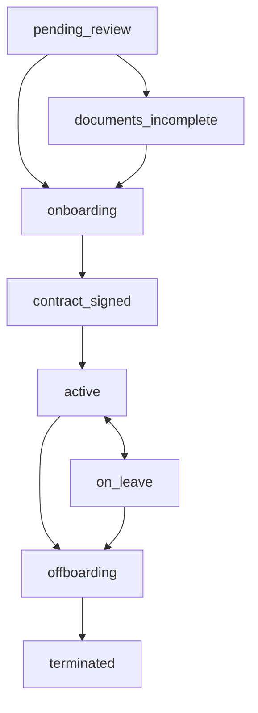
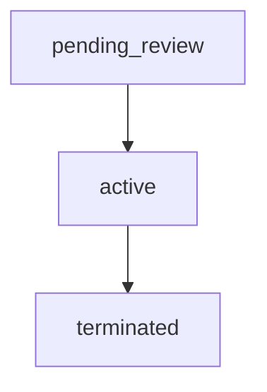
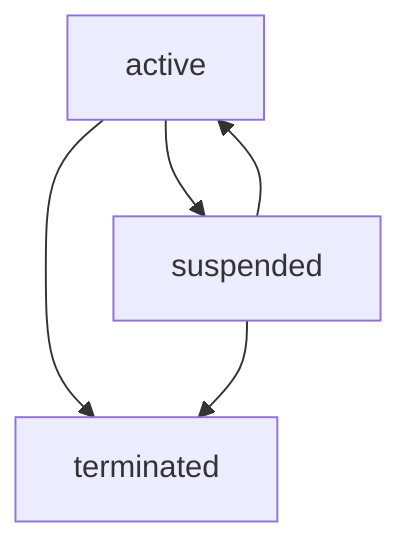
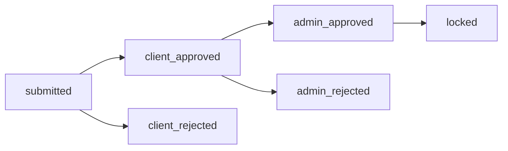
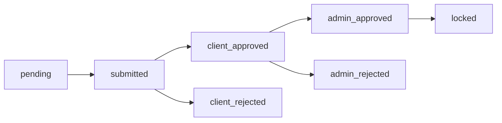
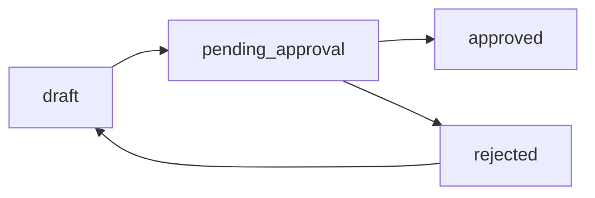
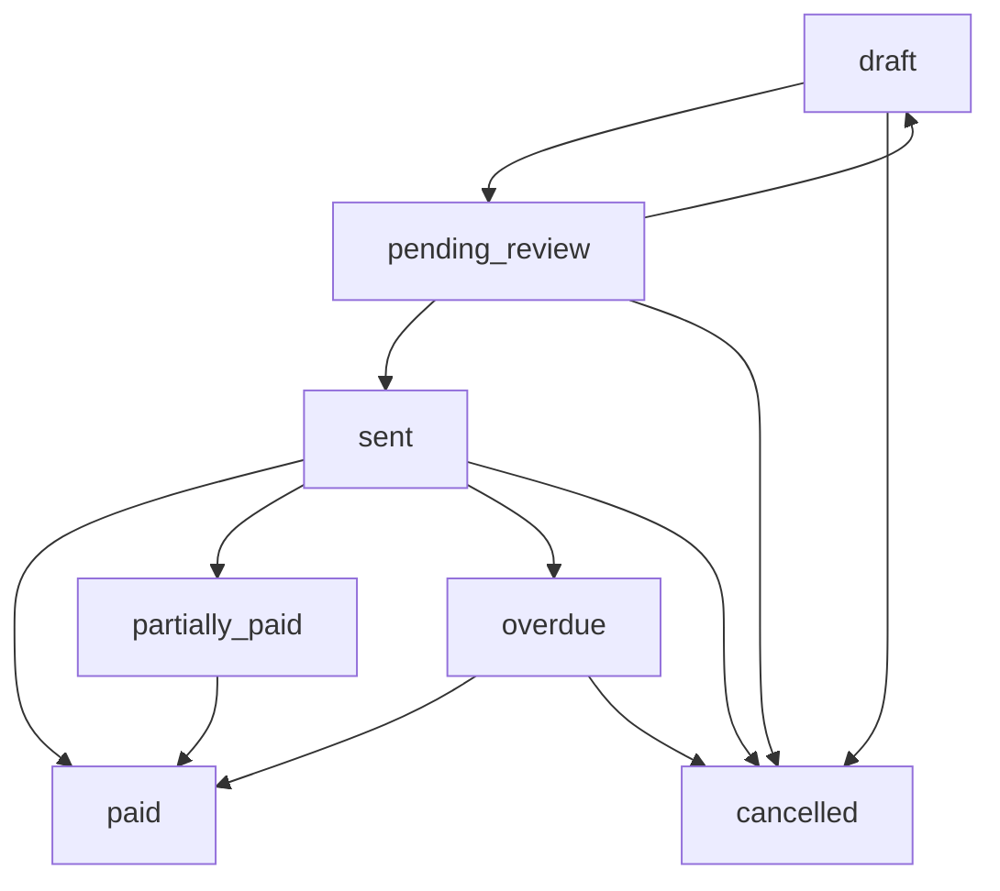
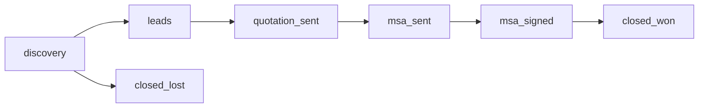
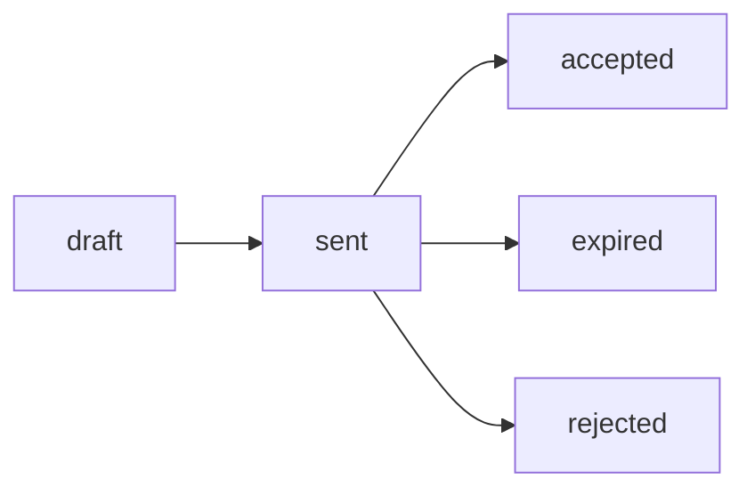

# GEA Platform 核心业务逻辑与状态流转 (SSOT)

本文档是 GEA Platform 核心业务逻辑的单点真相（Single Source of Truth）。所有开发人员在修改业务代码前，必须先理解并遵循本文档中定义的状态机和流转规则。

---

## 1. 核心概念：Employee (EOR) vs Contractor (AOR)

系统支持两种核心用工模式，它们在数据结构、计费方式和生命周期上存在本质区别。

| 维度 | Employee (EOR) | Contractor (AOR) |
|:---|:---|:---|
| **Schema 定义** | `drizzle/schema.ts` (`employees` 表) | `drizzle/aor-schema.ts` (`contractors` 表) |
| **编号前缀** | `EMP-0001` | `CTR-0001` |
| **服务类型** | `eor`, `visa_eor` | `aor` |
| **薪资模式** | 固定月薪 (`baseSalary` + `salaryCurrency`) | 灵活计费 (`fixed_monthly`, `hourly`, `milestone_only`) |
| **计费周期** | 统一按月 (`monthly`) | 灵活 (`monthly`, `semi_monthly`, `milestone`) |
| **押金 (Deposit)** | 有（Onboarding 时自动生成 Deposit Invoice） | 无 |
| **签证追踪** | 有（`requiresVisa`, `visaStatus`） | 无 |
| **里程碑 (Milestones)** | 无 | 有（`contractor_milestones` 表） |
| **薪资发放 (Payroll)** | 纳入国家级 Payroll Run（按国家+月份聚合） | 独立 Contractor Invoice（按承包商+月份生成） |
| **客户发票类型** | `monthly_eor`, `monthly_visa_eor` | `monthly_aor` |
| **Worker Portal** | 有（Payslips, Leave, Reimbursements） | 有（Milestones, Invoices） |

---

## 2. 状态机与生命周期

### 2.1 Employee (EOR) 生命周期
Employee 的状态流转是单向的，涵盖从入职到离职的全过程：

**关键触发器：**
- **`onboarding`**: 当状态变为 `onboarding` 时，系统自动生成 **Deposit Invoice**（押金发票）。
- **`active`**: 由 Cron Job (`employee_activation`) 在 `startDate` 到达时自动从 `contract_signed` 转换。
- **`on_leave`**: 由 Cron Job (`leave_transition`) 根据请假记录的起止日期自动在 `active` 和 `on_leave` 之间切换。
- **`terminated`**: 由 Cron Job (`employee_termination`) 在 `endDate` 到达时自动从 `offboarding` 转换。此时系统会自动生成 **Deposit Refund Invoice**（押金退款发票），并停止所有周期性调整（Recurring Adjustments）。

### 2.2 Contractor (AOR) 生命周期
Contractor 的生命周期相对简单：

### 2.3 客户 (Customer) 生命周期

---

## 3. 运营模块 (Operations) 审批链路

所有运营相关的请求（Adjustments, Reimbursements, Leave, Milestones）都遵循标准的三级审批链路。

### 3.1 EOR Adjustments / Reimbursements / Leave 审批链路

- **提交 (submitted)**: 由 Worker 或 Client 提交。
- **客户审批 (client_approved/rejected)**: 由 Portal HR Manager 执行。
- **平台审批 (admin_approved/rejected)**: 由 Admin Operations Manager 执行。
- **锁定 (locked)**: 由每月 5 日的 Auto-Lock Cron Job 自动执行，或在生成 Payroll Run 时锁定。锁定后数据不可修改，并正式计入当月薪资。

### 3.2 AOR Contractor Milestones 审批链路

- **待提交 (pending)**: 里程碑已创建，等待 Worker 交付。
- **已提交 (submitted)**: Worker 上传交付物 (`deliverableFileUrl`) 并提交。
- 后续审批与 EOR 相同。

---

## 4. 薪资与发票 (Payroll & Finance) 逻辑

### 4.1 Payroll Run (EOR)
Payroll Run 是按**国家 + 月份**聚合的，而不是按客户。一个国家的 Payroll Run 包含该国所有客户的活跃员工。

**状态流转：**

- **`draft`**: 每月 5 日由 Cron Job (`payroll_create`) 自动创建。
- **`pending_approval`**: Operations Manager 检查无误后提交。
- **`approved`**: 另一个 Operations Manager 或 Admin 交叉审批通过。只有 Approved 的 Payroll Run 才能生成客户发票。

### 4.2 Client Invoice 状态机
客户发票涵盖所有费用（EOR 薪资、AOR 费用、服务费、押金等）。

**状态流转：**

**发票类型 (`invoiceType`)：**
1. `deposit`: 押金（Onboarding 触发）
2. `monthly_eor`: 月度 EOR 薪资与服务费
3. `monthly_visa_eor`: 月度带签证的 EOR 费用
4. `monthly_aor`: 月度 AOR 费用
5. `visa_service`: 独立签证服务费
6. `deposit_refund`: 押金退款（Termination 触发）
7. `credit_note`: 贷记凭证（用于抵扣或退款）
8. `manual`: 手动创建的杂项发票

### 4.3 Wallet 双账户体系
系统为每个客户维护两个物理隔离的钱包，使用乐观锁 (`version`) 防止并发更新。

1. **Main Wallet (可用余额)**
   - **增加 (+)**: `credit_note_in`, `overpayment_in`, `top_up`, `invoice_refund`, `manual_adjustment`
   - **减少 (-)**: `invoice_deduction` (用于支付发票), `payout` (提现), `manual_adjustment`

2. **Frozen Wallet (押金/保证金)**
   - **增加 (+)**: `deposit_in` (客户支付了 Deposit Invoice), `manual_adjustment`
   - **减少 (-)**: `deposit_release` (转入主钱包), `deposit_refund` (退回银行), `deposit_deduction` (抵扣欠款), `manual_adjustment`

### 4.4 Release Task 机制
当系统生成 `credit_note` 或 `deposit_refund` 发票时，它们会出现在 Finance 模块的 Release Tasks 列表中。
Finance Manager 必须审批并选择资金去向 (`disposition`)：
- **`to_wallet`**: 资金转入客户的 Main Wallet，发票状态变为 `applied`。
- **`to_bank`**: 资金通过线下银行转账退回给客户，发票状态变为 `paid`。

---

## 5. 月度运营时间线 (Cron Jobs)

系统高度依赖 Cron Jobs 驱动月度流转。以 2 月份为例，时间线如下（均为北京时间）：

| 日期与时间 | Cron Job Key | 执行动作 |
|:---|:---|:---|
| **每天 00:01** | `employee_activation` | 将 `startDate` 到达的员工从 `contract_signed` 转为 `active` |
| **每天 00:01** | `employee_termination` | 将 `endDate` 到达的员工从 `offboarding` 转为 `terminated` |
| **每天 00:02** | `leave_transition` | 根据请假起止日期，在 `active` 和 `on_leave` 之间自动切换 |
| **每天 00:05** | `exchange_rate` | 从 API 获取最新汇率（下午 18:00 还有一次 `exchange_rate_afternoon`） |
| **每月 1 日 00:00** | `recurring_adjustment_generation` | 为生效的周期性模板（每月/永久）生成当月的子调整记录 |
| **每月 1 日 00:10** | `leave_accrual` | 为当年入职的员工按月累计年假额度 |
| **每月 1-4 日** | - | 客户和员工提交上月 (1月) 的 Adjustments, Reimbursements, Leave |
| **每月 5 日 00:00** | `auto_lock` | **数据锁定**：将 1 月份所有 `admin_approved` 的运营数据状态更新为 `locked`。未审批的数据将被推迟到下个月。 |
| **每月 5 日 00:05** | `payroll_create` | **生成账单**：为所有活跃国家创建 2 月份的 Draft Payroll Run，并生成 2 月份的 Contractor Invoices。 |

---

## 6. 系统设置与全局配置 (Settings)

### 6.1 Admin Settings
- **Countries**: 配置各国的法定标准（试用期、通知期、法定年假）、默认服务费率（EOR/AOR/Visa）和增值税（VAT）。
- **Payroll Config**: 配置全局业务规则（如 Cutoff Day）和管理所有 Cron Jobs。
- **Exchange Rates**: 管理汇率及 Markup Percentage（默认 5%）。
- **Billing Entities**: 管理开票主体（Logo、前缀、银行账户、付款条款）。
- **Notifications**: 管理 13 种系统通知事件的触发通道（Email/In-App）和接收者。

### 6.2 Portal Settings (客户自助)
- **Company Profile**: 客户公司基本信息。
- **Leave Policies**: 客户自定义假期政策（必须大于等于国家法定最低标准）。
- **Team Management**: 客户邀请其内部 HR/Finance 人员加入 Portal。

---

## 7. 销售与 CRM (Sales CRM)

系统内置轻量级 CRM，管理从线索到签约的全过程。

**Pipeline 状态机：**

**Quotation (报价单) 状态机：**

*注：Quotation 包含 `snapshotData`，记录生成报价时的汇率、费率和薪资快照，确保审计可追溯。*

---

## 8. 知识库与内容引擎 (Knowledge Base)

知识库支持外部源抓取和 AI 自动生成。

**AI 自动发布规则 (Tiered Auto-Publish)：**
基于 AI 置信度 (`aiConfidence`) 和信息源权威性 (`authorityLevel`) 决定发布动作：
- **`auto_publish`**: 置信度 >= 85 且权威性 High；或置信度 >= 70 且权威性 High/Medium。
- **`pending_review`**: 置信度 50-69，或高风险内容（`riskScore` >= 70）。
- **`auto_discard`**: 置信度 < 50。

**内容刷新机制：**
每天 03:00 执行 `knowledge_content_refresh`，检测过期文章（`expiresAt` 到期）或陈旧文章（发布超过 12 个月），标记为 `needsRefresh` 或 `isStale`。
