# GEA 平台运营手册

**版本:** 1.0  
**日期:** 2026年3月14日  
**适用对象:** Admin, Customer Manager (AM), Operations Manager (Ops), Finance Manager, Sales  
**密级:** 内部文档 — 仅限 GEA 内部团队使用

---

## 目录

- [第一章：业务基础与核心概念](#第一章业务基础与核心概念)
  - [1.1 核心术语表](#11-核心术语表-glossary)
  - [1.2 系统角色与权限边界](#12-系统角色与权限边界)
  - [1.3 核心实体状态机](#13-核心实体状态机-state-machines)
- [第二章：标准流程解读](#第二章标准流程解读自动化--人工--完整流转)
  - [2.1 EOR 月度薪资周期](#21-eor-月度薪资周期核心主流程)
  - [2.2 三大项审批流程](#22-三大项审批流程通用)
  - [2.3 AOR 承包商付款周期](#23-aor-承包商付款周期)
  - [2.4 客户全生命周期](#24-客户全生命周期简述)
  - [2.5 七大自动化任务总览](#25-七大自动化任务cron-jobs总览)
- [第三章：各岗位实操指南](#第三章各岗位实操指南-role-specific-playbooks)
  - [3.1 客户成功经理 (AM)](#31-客户成功经理-am-操作指南)
  - [3.2 运营专员 (Ops)](#32-运营专员-ops-操作指南)
  - [3.3 财务专员 (Finance)](#33-财务专员-finance-操作指南)
  - [3.4 销售代表 (Sales)](#34-销售代表-sales-操作指南)
- [附录 A：状态机速查表](#附录-a状态机速查表)
- [附录 B：Cron Job 配置参考](#附录-bcron-job-配置参考)

---

## 第一章：业务基础与核心概念

GEA 平台是一套面向全球化企业的 **EOR（名义雇主）** 和 **AOR（名义代理）** 服务管理系统。它将员工薪资计算、承包商付款、客户发票、合规审批等复杂的跨国人力资源流程，整合到一个统一的数字化平台中。本章将建立所有团队成员必须掌握的业务基础知识。

### 1.1 核心术语表 (Glossary)

为了确保各团队在沟通中没有歧义，以下是 GEA 平台中最核心的业务术语定义。所有状态标签均保留系统中的英文原文，不做翻译。

| 术语 | 英文全称 | 业务含义 |
|------|---------|----------|
| **EOR** | Employer of Record | 名义雇主。GEA 作为法定雇主，代客户在当地雇佣员工，负责合规、薪资、税务和福利。 |
| **AOR** | Agent of Record | 名义代理。GEA 作为代理机构，代客户与独立承包商（Contractor）签订合同并支付服务费。 |
| **三大项** | Adjustments, Leave Records, Reimbursements | 影响当月薪资计算的三个核心变量：调整项（奖金/扣款/津贴）、假期记录（带薪/无薪假）、独立报销。 |
| **Payroll Run** | Payroll Run | 薪资单。按国家和月份生成的批量发薪记录，包含基础工资和"三大项"的结算结果。 |
| **Cutoff** | Cutoff Day/Time | 数据提报截止时间。默认为每月 4 号 23:59（北京时间），过了此时间，客户和员工无法再提交或修改上个月的"三大项"数据。 |
| **Pro-rata** | Pro-rata | 按比例计算。常用于计算月中入职或离职员工的当月应得薪资（按实际工作日 / 当月总工作日）。 |
| **Sign-on Bonus** | Sign-on Bonus | 针对在月中截止日（15号）之后入职的员工，系统自动生成的一笔 Adjustment，用于在下个月补发其入职当月的 pro-rata 薪资。 |
| **N-1 月归属** | N-1 Month Attribution | 核心数据流规则：本月（N月）的 Payroll Run 消费的是上月（N-1月）提交并锁定的三大项数据。 |
| **Locked** | Locked Status | 锁定状态。当"三大项"数据被后台 Cron Job 锁定后，意味着它们已经被纳入发薪流程，不可再被直接修改。 |
| **payrollRunId** | payrollRunId | 薪资单追踪标识。当三大项数据被某个 Payroll Run 消费后，系统会在该数据上打上对应的 payrollRunId，实现数据溯源。 |
| **Milestone** | Contractor Milestone | 承包商里程碑。针对按项目计费的承包商，完成特定阶段工作后提交的付款申请节点。 |
| **Billing Entity** | Billing Entity | 结算实体。客户用来支付发票的法定公司主体，一个客户可以有多个结算实体（如不同国家的子公司）。 |
| **Vendor Bill** | Vendor Bill | 供应商账单。GEA 需要向外部供应商（如当地的 EOR 合作伙伴、保险公司）支付的账单。 |
| **MSA** | Master Service Agreement | 主服务协议。客户与 GEA 签署的总框架合同。 |
| **Cron Job** | Cron Job | 定时任务。系统后台按预设时间自动执行的批处理任务，共 7 个。 |

### 1.2 系统角色与权限边界

GEA 平台由三个独立的门户（Portal）组成，面向不同的用户群体。内部团队通过 **Admin Portal** 进行所有管理操作。

| 门户 | 用户群体 | 核心功能 |
|------|---------|----------|
| **Admin Portal** | GEA 内部团队（Admin, AM, Ops, Finance, Sales） | 全量管理功能：员工/承包商管理、薪资审核、发票开具、客户管理、系统配置 |
| **Client Portal** | 客户公司的 HR / 管理人员 | 查看员工列表、审批三大项、查看发票、下载报表 |
| **Worker Portal** | 员工和承包商本人 | 填写个人信息、提交报销/假期、查看工资单、提交 Milestone |

以下是 Admin Portal 中各角色的权限边界。每个内部用户可以拥有一个或多个管理角色（`admin` 除外，它是排他性的超级角色）。

| 角色 | 核心操作范围 | 特殊权限 |
|------|-------------|----------|
| **Admin** | 所有模块 | 可突破 Client Cutoff 限制进行数据修改（但仍受合规红线约束） |
| **Customer Manager (AM)** | `customers`, `onboardingInvites`, `customerContracts` | 客户入职全流程管理 |
| **Operations Manager (Ops)** | `employees`, `adjustments`, `leaveRecords`, `reimbursements`, `payrollRuns`, `contractors` | 三大项审批、薪资单审核 |
| **Finance Manager** | `invoices`, `contractorInvoices`, `vendorBills`, `payrollRuns`（最终审批） | 薪资单最终审批权、发票开具与核销 |
| **Sales** | `salesLeads`, `quotations` | 销售线索和报价单管理 |

### 1.3 核心实体状态机 (State Machines)

系统中的数据流转完全依赖于状态机（State Machine）。**严禁跳过中间状态进行强制变更**，否则会导致自动化 Cron Job 无法正确抓取数据。以下是各核心实体的状态流转定义，每个状态均使用系统中的英文原文标签。

#### 1.3.1 EOR 员工状态流转 (`employees.status`)

员工的生命周期是系统中最复杂的流程，横跨 AM 和 Ops 两个团队。

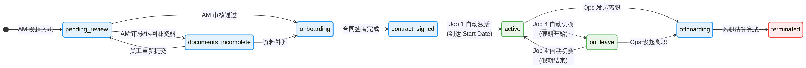

| 状态 | 含义 | 触发方式 | 负责角色 |
|------|------|---------|----------|
| `pending_review` | AM 发起入职邀请，等待内部审核 | 创建 Onboarding Invite 后自动生成 | AM |
| `documents_incomplete` | 员工正在 Worker Portal 填写个人信息和上传证件 | 员工开始填写表单 | 员工 |
| `onboarding` | 员工信息已提交，等待 AM 审核和生成雇佣合同 | 员工提交完整信息 | AM |
| `contract_signed` | 合同已签署，等待到达入职日期（Start Date） | AM 确认合同签署 | AM |
| `active` | 正式在职，进入常规发薪周期 | **Job 1 自动激活**（startDate 到达时） | 系统 |
| `on_leave` | 员工当前处于休假状态 | **Job 4 每日自动切换** | 系统 |
| `offboarding` | 已发起离职流程，正在进行最后清算 | Ops 手动发起 | Ops |
| `terminated` | 离职流程完成，彻底终止 | Ops 确认清算完毕 | Ops |

#### 1.3.2 三大项通用状态流转 (`adjustments` / `leaveRecords` / `reimbursements`)

Adjustments、Leave Records 和 Reimbursements 共享同一套严格的双重审批流。这是 GEA 平台合规性的核心保障。

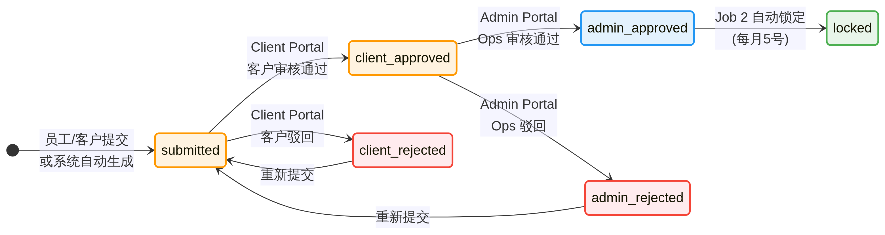

| 状态 | 含义 | 触发方式 | 负责角色 |
|------|------|---------|----------|
| `submitted` | 数据已提交，等待客户审核 | 员工/客户在 Portal 提交，或系统自动生成（如 Sign-on Bonus） | 员工/客户/系统 |
| `client_approved` | 客户已审核通过 | 客户在 Client Portal 点击 Approve | 客户 |
| `client_rejected` | 客户已驳回 | 客户在 Client Portal 点击 Reject | 客户 |
| `admin_approved` | Ops 已审核通过 | Ops 在 Admin Portal 点击 Approve | Ops |
| `admin_rejected` | Ops 已驳回 | Ops 在 Admin Portal 点击 Reject | Ops |
| `locked` | 已被系统锁定，准备进入薪资单 | **Job 2 每月 5 号自动锁定** | 系统 |

> **关键规则**：一旦数据进入 `locked` 状态，禁止直接修改。如需更正，必须在 Payroll Run 的 `draft` 阶段通过 Ops 手动添加或删除 Payroll Item 来调整。

#### 1.3.3 Payroll Run 状态流转 (`payrollRuns.status`)

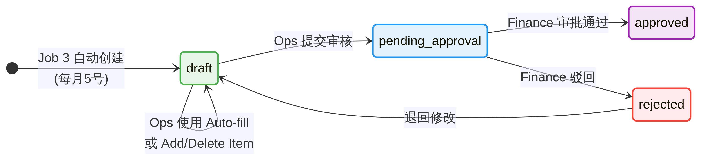

| 状态 | 含义 | 触发方式 | 负责角色 |
|------|------|---------|----------|
| `draft` | 薪资单草稿，可编辑 | **Job 3 每月 5 号自动创建** | 系统 |
| `pending_approval` | Ops 已提交，等待 Finance 审批 | Ops 点击 Submit for Approval | Ops |
| `approved` | Finance 已审批通过，薪资单定稿 | Finance 点击 Approve | Finance |
| `rejected` | Finance 打回，退回 `draft` 状态 | Finance 点击 Reject | Finance |

> **红线警告**：Ops **绝对不要**在每月 15 号之前将薪资单提交至 `approved` 状态。原因是 15 号前入职的新员工需要通过系统自动 Pro-rata 加入当月薪资单，而 `approved` 状态的薪资单将拒绝任何数据变更。

#### 1.3.4 客户发票状态流转 (`invoices.status`)

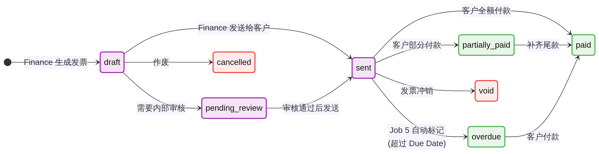

| 状态 | 含义 | 触发方式 | 负责角色 |
|------|------|---------|----------|
| `draft` | 发票草稿，尚未发送 | Finance 手动创建或系统自动生成 | Finance/系统 |
| `pending_review` | 需要进一步内部审核（如金额异常） | Finance 标记 | Finance |
| `sent` | 已发送给客户，等待付款 | Finance 点击 Send | Finance |
| `paid` | 客户已全额付款 | Finance 手动核销 | Finance |
| `partially_paid` | 客户支付了部分款项 | Finance 记录部分到账 | Finance |
| `overdue` | 超过 Due Date 未付款 | **Job 5 每日自动标记** | 系统 |
| `cancelled` | 发票已取消 | Finance 手动取消 | Finance |
| `void` | 发票作废（如生成错误需重开） | Finance 手动作废 | Finance |
| `applied` | 信用票据已抵扣 | 系统自动标记 | 系统 |

#### 1.3.5 AOR 承包商状态流转 (`contractors.status`)

| 状态 | 含义 | 触发方式 | 负责角色 |
|------|------|---------|----------|
| `pending_review` | 承包商信息待审核 | AM 创建承包商记录 | AM |
| `active` | 承包商已激活，可正常付款 | Ops 审核通过 | Ops |
| `terminated` | 承包商已终止合作 | Ops 手动终止 | Ops |

#### 1.3.6 承包商里程碑状态流转 (`contractorMilestones.status`)

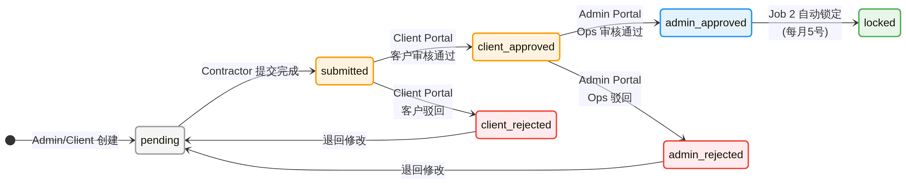

| 状态 | 含义 | 触发方式 | 负责角色 |
|------|------|---------|----------|
| `pending` | 里程碑已创建，等待承包商提交 | 系统或 Ops 创建 | Ops/系统 |
| `submitted` | 承包商已提交完成证明 | 承包商在 Worker Portal 提交 | 承包商 |
| `client_approved` | 客户已审核通过 | 客户在 Client Portal 点击 Approve | 客户 |
| `client_rejected` | 客户已驳回 | 客户在 Client Portal 点击 Reject | 客户 |
| `admin_approved` | Ops 已审核通过 | Ops 在 Admin Portal 点击 Approve | Ops |
| `admin_rejected` | Ops 已驳回 | Ops 在 Admin Portal 点击 Reject | Ops |
| `locked` | 已被系统锁定，准备生成 Invoice | **Job 2 每月 5 号自动锁定** | 系统 |

#### 1.3.7 承包商发票状态流转 (`contractorInvoices.status`)

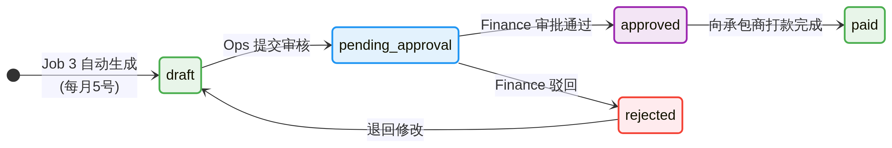

| 状态 | 含义 | 触发方式 | 负责角色 |
|------|------|---------|----------|
| `draft` | 系统自动生成的发票草稿 | **Job 3 每月 5 号自动创建** | 系统 |
| `pending_approval` | 等待 Finance 审批 | Ops 提交 | Ops |
| `approved` | Finance 已审批，准备打款 | Finance 点击 Approve | Finance |
| `paid` | 已向承包商打款 | Finance 确认打款 | Finance |
| `rejected` | Finance 打回 | Finance 点击 Reject | Finance |

#### 1.3.8 供应商账单状态流转 (`vendorBills.status`)

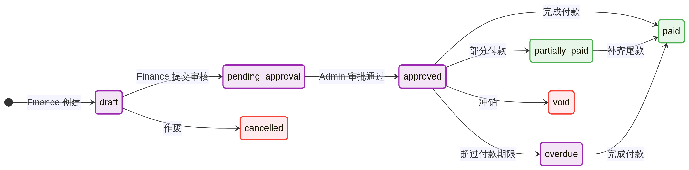

| 状态 | 含义 | 触发方式 | 负责角色 |
|------|------|---------|----------|
| `draft` | 账单草稿 | Finance 手动创建 | Finance |
| `pending_approval` | 等待审批 | Finance 提交 | Finance |
| `approved` | 已审批，准备付款 | 审批人点击 Approve | Finance |
| `paid` | 已全额付款 | Finance 确认付款 | Finance |
| `partially_paid` | 已部分付款 | Finance 记录部分付款 | Finance |
| `overdue` | 超过付款期限 | 系统或 Finance 标记 | Finance/系统 |
| `cancelled` | 已取消 | Finance 手动取消 | Finance |
| `void` | 已作废 | Finance 手动作废 | Finance |
| `applied` | 押金类账单已抵扣 | 系统标记 | 系统 |

#### 1.3.9 销售线索状态流转 (`salesLeads.status`)

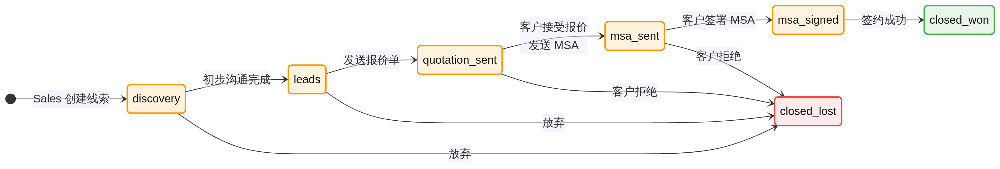

| 状态 | 含义 | 触发方式 | 负责角色 |
|------|------|---------|----------|
| `discovery` | 初始发现阶段 | Sales 创建线索 | Sales |
| `leads` | 已确认为有效线索 | Sales 推进 | Sales |
| `quotation_sent` | 已发送报价单 | Sales 发送 Quotation | Sales |
| `msa_sent` | 已发送主服务协议 | Sales 发送 MSA | Sales |
| `msa_signed` | 客户已签署 MSA | 客户签署确认 | Sales |
| `closed_won` | 成交 | Sales 标记 | Sales |
| `closed_lost` | 丢单 | Sales 标记（需填写 lostReason） | Sales |

#### 1.3.10 报价单状态流转 (`quotations.status`)

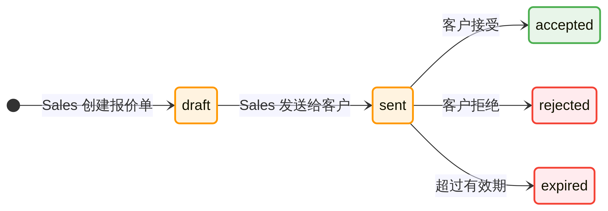

| 状态 | 含义 | 触发方式 | 负责角色 |
|------|------|---------|----------|
| `draft` | 报价单草稿 | Sales 创建 | Sales |
| `sent` | 已发送给客户 | Sales 点击 Send | Sales |
| `accepted` | 客户已接受 | 客户确认 | 客户 |
| `expired` | 报价单已过期 | 超过有效期 | 系统 |
| `rejected` | 客户已拒绝 | 客户拒绝 | 客户 |

#### 1.3.11 入职邀请状态流转 (`onboardingInvites.status`)

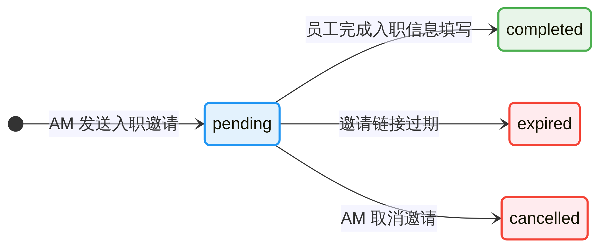

| 状态 | 含义 | 触发方式 | 负责角色 |
|------|------|---------|----------|
| `pending` | 邀请已发送，等待员工/承包商完成 | AM 创建并发送邀请 | AM |
| `completed` | 员工/承包商已完成入职信息填写 | 员工在 Worker Portal 完成所有步骤 | 员工 |
| `expired` | 邀请已过期 | 超过 expiresAt 时间 | 系统 |
| `cancelled` | 邀请已取消 | AM 手动取消 | AM |

---

## 第二章：标准流程解读（自动化 + 人工 = 完整流转）

GEA 平台的运转是"后台自动化（Cron Jobs）"与"人工审批操作"紧密咬合的结果。理解这两种力量如何交替接管数据，是每个运营人员的基本功。本章将完整拆解各核心业务流程。

### 2.1 EOR 月度薪资周期（核心主流程）

EOR 的薪资计算遵循一个不可动摇的行业规则：**"本月发薪，拉取上月异动数据"（N-1 月归属）**。例如，3月的 Payroll Run 中，包含的是3月的基础工资，以及2月份提交并锁定的三大项（Adjustments, Leave Records, Reimbursements）。

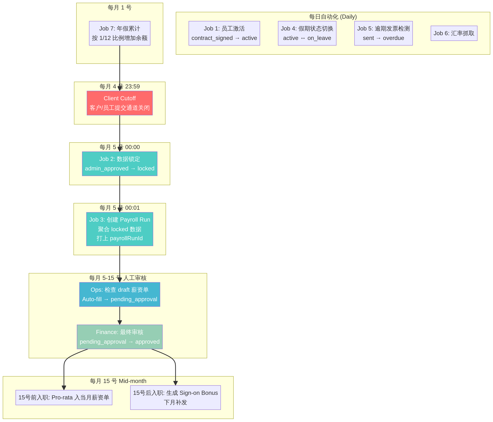

整个周期以"月"为单位循环运转。以下是标准的月度时间轴，按时间顺序排列：

**每日凌晨自动化（00:00 - 00:10 北京时间）**

系统每天凌晨自动执行四项任务，确保数据的实时性：

| 时间 | 任务 | 系统行为 |
|------|------|---------|
| 00:01 | **Job 1: 员工自动激活** | 扫描所有 `contract_signed` 状态的员工，如果今天达到了他们的 Start Date，自动将其转为 `active`。同时判断入职日期：若 ≤ 15号，自动 Pro-rata 加入当月薪资单；若 > 15号，自动生成 Sign-on Bonus Adjustment（状态为 `submitted`，effectiveMonth 为下个月）。 |
| 00:02 | **Job 4: 假期状态切换** | 扫描所有 `active` 员工的假期记录，如果今天是假期开始日，将员工状态切换为 `on_leave`；如果今天是假期结束日的次日，恢复为 `active`。 |
| 00:03 | **Job 5: 逾期发票检测** | 扫描所有 `sent` 状态的客户发票，如果今天超过了 Due Date，自动标记为 `overdue`。 |
| 00:05 | **Job 6: 汇率抓取** | 从 ExchangeRate-API 获取最新汇率（覆盖 166 种货币），备用数据源为 Frankfurter/ECB。 |

**每月 1 号凌晨**

| 时间 | 任务 | 系统行为 |
|------|------|---------|
| 00:10 | **Job 7: 年假自动累计** | 为当年入职的所有 `active` 员工，按 1/12 的比例自动增加年假余额。 |

**每月 4 号 23:59（Client Cutoff）**

这是**客户和员工的数据提交截止时间**。过了这一刻，Client Portal 和 Worker Portal 将禁止提交或修改上个月的三大项数据。Cutoff 时间可在 Admin Portal 的 Settings 页面中配置。

> **重要提示**：Admin 角色可以突破 Cutoff 限制，在 Admin Portal 中手动为上个月补建三大项数据。但即使是 Admin 创建的数据，也必须遵守合规红线——必须由客户在 Client Portal 再次点击 Approve 确认，才能走完后续审批流程。

**每月 5 号 00:00（数据锁定 — Job 2）**

系统自动执行批量锁定操作：

- 将所有处于 `admin_approved` 状态的上月 EOR 三大项数据（Adjustments, Leave Records, Reimbursements）变更为 `locked`。
- 将所有处于 `admin_approved` 状态的上月 AOR 承包商数据（Contractor Adjustments, Contractor Milestones）变更为 `locked`。

**每月 5 号 00:01（创建薪资单 — Job 3）**

系统自动执行薪资单创建和数据聚合：

1. 为每个拥有 `active` 员工的国家，自动创建本月的 Payroll Run（状态为 `draft`）。
2. 自动聚合刚刚被锁定的上月三大项数据到对应的 Payroll Run 中。
3. 自动聚合 `reimbursements` 表中已 `locked` 的报销数据。
4. 为被消费的三大项数据打上 `payrollRunId` 烙印，实现数据追踪和溯源。
5. 同时为承包商生成 Contractor Invoices（根据付款频率：monthly / semi_monthly / milestone）。

**每月 5 号 - 15 号（人工审核与审批窗口）**

| 步骤 | 操作 | 负责角色 |
|------|------|---------|
| 1 | 登录 Admin Portal，进入 Payroll Runs 列表，筛选 `draft` 状态的本月薪资单 | Ops |
| 2 | 逐一检查每个国家的薪资单，核对基础工资、各项补贴和扣款 | Ops |
| 3 | 如发现数据遗漏，点击 **Auto-fill** 重新拉取上月已 `locked` 的数据 | Ops |
| 4 | 确认无误后，点击 **Submit for Approval**，状态变更为 `pending_approval` | Ops |
| 5 | 审核 Ops 提交的薪资单，核对各项金额 | Finance |
| 6 | 确认无误后，点击 **Approve**，状态变更为 `approved` | Finance |

**每月 15 号（月中分界线 / Mid-month Cutoff）**

这是判断新入职员工如何发薪的关键分界线：

| 入职时间 | 系统行为 | 说明 |
|---------|---------|------|
| **15号及之前入职** | Job 1 自动激活员工，并按 Pro-rata 将其加入当月 `draft` 状态的薪资单 | 这就是为什么 Ops **绝对不能**在 15 号前将薪资单 Approve 的原因 |
| **15号之后入职** | Job 1 自动激活员工，但**不会**将其加入当月薪资单。同时自动生成一笔 Sign-on Bonus Adjustment（`submitted` 状态，effectiveMonth = 下个月） | 该 Sign-on Bonus 将在下个月的薪资周期中被消费 |

### 2.2 三大项审批流程（通用）

无论是员工提交的报销，还是客户发起的奖金，三大项必须经历完整的双重审批流才能进入薪资单。

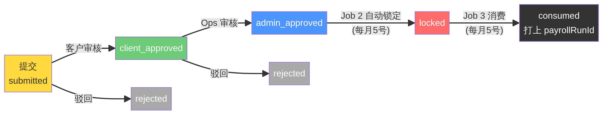

**标准审批流程：**

| 阶段 | 状态变更 | 操作人 | 操作位置 |
|------|---------|--------|---------|
| 提交 | → `submitted` | 员工/客户/系统 | Worker Portal / Client Portal / 系统自动 |
| 客户审核 | → `client_approved` 或 `client_rejected` | 客户 HR | Client Portal |
| 运营审核 | → `admin_approved` 或 `admin_rejected` | Ops | Admin Portal |
| 系统锁定 | → `locked` | 系统 Job 2 | 每月 5 号自动执行 |
| 消费入薪资单 | 打上 `payrollRunId` | 系统 Job 3 | 每月 5 号自动执行 |

**特殊情况处理：**

Admin 角色拥有特权，可以在 4 号 Cutoff 之后手动在 Admin Portal 中补建三大项数据。但即使是 Admin 创建的数据，也必须遵守以下合规红线：

1. Admin 补建的数据初始状态为 `submitted`。
2. 必须由客户在 Client Portal 点击 Approve，变为 `client_approved`。
3. 再由 Ops 在 Admin Portal 点击 Approve，变为 `admin_approved`。
4. 等待下一个月 5 号的 Job 2 自动锁定。

> **注意**：如果 Admin 在 5 号之后补建数据，该数据将错过本月的锁定窗口，只能在下个月的薪资周期中被消费。

### 2.3 AOR 承包商付款周期

与 EOR 复杂的 N-1 月归属逻辑不同，AOR（承包商）的付款逻辑相对简单直接。系统支持三种计费模式，每种模式在 Job 3 中的处理方式不同。

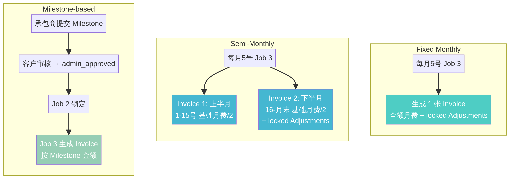

| 计费模式 | 英文标识 | Job 3 生成逻辑 |
|---------|---------|---------------|
| **月度固定** | `monthly` | 每月 5 号自动生成 **1 张** Contractor Invoice，包含全额月费 + 所有已 `locked` 的 Contractor Adjustments |
| **半月度固定** | `semi_monthly` | 每月 5 号自动生成 **2 张** Contractor Invoice：上半月（1-15号）只有基础月费的一半；下半月（16-月末）包含另一半月费 + 所有已 `locked` 的 Contractor Adjustments |
| **按项目里程碑** | `milestone` | 没有固定月费。只有当承包商提交的 Milestone 经过客户和 Ops 双重审批变为 `admin_approved`，并在 5 号被 Job 2 锁定后，Job 3 才会为其生成对应的 Contractor Invoice |

**承包商 Adjustment 审批流程**与 EOR 三大项完全一致：`submitted` → `client_approved` → `admin_approved` → `locked`。

### 2.4 客户全生命周期（简述）

客户从获客到日常运营，横跨 Sales → AM → Ops → Finance 四个团队。

| 阶段 | 负责团队 | 核心操作 |
|------|---------|---------|
| **获客** | Sales | 录入 Sales Lead，发送 Quotation（报价单） |
| **签约** | Sales | 客户接受报价后，发送 MSA（主服务协议），客户签署 |
| **入职** | AM | 创建 Customer 实体，配置 Billing Entity，发送 Onboarding Invites |
| **运营** | Ops | 进入每月的薪资和三大项审批循环 |
| **结算** | Finance | 每月生成客户发票，追踪收款，处理逾期 |

*(注：员工入职/离职的详细操作流程，将在入职/离职优化专项完成后更新至本手册)*

### 2.5 七大自动化任务（Cron Jobs）总览

系统共有 7 个 Cron Job，全部可在 Admin Portal 的 **Settings → Scheduled Jobs** 中进行动态配置（启用/禁用、调整执行时间、手动触发）。

| 编号 | 任务名称 | 频率 | 默认时间 | 核心功能 |
|------|---------|------|---------|---------|
| Job 1 | Employee Auto-Activation | 每日 | 00:01 | 激活到达 Start Date 的员工，处理 Pro-rata 和 Sign-on Bonus |
| Job 2 | Auto-Lock Data (EOR+AOR) | 每月 | 5号 00:00 | 锁定上月所有 `admin_approved` 的三大项和承包商数据 |
| Job 3 | Auto-Create Payroll Runs & Contractor Invoices | 每月 | 5号 00:01 | 创建薪资单、聚合数据、生成承包商发票 |
| Job 4 | Leave Status Transition | 每日 | 00:02 | 根据假期记录自动切换员工 `active` ↔ `on_leave` |
| Job 5 | Overdue Invoice Detection | 每日 | 00:03 | 标记超期未付的客户发票为 `overdue` |
| Job 6 | Exchange Rate Fetch | 每日 | 00:05 | 从 ExchangeRate-API 抓取 166 种货币的最新汇率 |
| Job 7 | Monthly Leave Accrual | 每月 | 1号 00:10 | 为当年入职员工按 1/12 比例累计年假余额 |

> **配置说明**：所有 Cron Job 的配置存储在 `system_config` 表中，配置键格式为 `cron_{job_key}_enabled`、`cron_{job_key}_day`、`cron_{job_key}_time`。修改配置后，系统会自动热加载新的调度计划，无需重启服务。

---

## 第三章：各岗位实操指南 (Role-specific Playbooks)

本章为各内部团队（AM, Ops, Finance, Sales）提供具体的日常操作指南。请根据你的岗位职责，阅读对应的部分。

*(注：员工入职/离职的详细操作流程，将在入职/离职优化专项完成后更新至本手册)*

### 3.1 客户成功经理 (AM) 操作指南

AM 是客户入驻平台的第一责任人，负责将 Sales 谈妥的客户平稳过渡到系统中，并管理客户的完整生命周期。

#### 3.1.1 核心职责

AM 的日常工作围绕以下三个核心职责展开：

1. **创建客户实体**：在 Admin Portal 中录入 Customer 信息，配置 Billing Entity（结算主体）。
2. **发送入职邀请**：为新员工和承包商发送 Onboarding Invites，引导他们在 Worker Portal 完成信息填写。
3. **日常客户沟通**：解答客户关于系统使用的疑问，协助处理紧急需求，作为客户与内部团队之间的桥梁。

#### 3.1.2 关键操作：配置结算主体 (Billing Entity)

Billing Entity 决定了系统如何向客户开具发票。一个客户可以有多个 Billing Entity（例如：按国家/地区划分，或按子公司划分）。

| 步骤 | 操作 | 注意事项 |
|------|------|---------|
| 1 | 登录 Admin Portal，进入 `Customers` 列表 | — |
| 2 | 点击目标客户进入详情页，选择 `Billing Entities` 标签 | — |
| 3 | 点击 `Add Billing Entity`，填写发票抬头、税号、账单接收邮箱等信息 | 确保税号格式正确 |
| 4 | 保存并验证 | **每个员工/承包商必须绑定到一个具体的 Billing Entity，否则系统无法为其生成发票** |

#### 3.1.3 关键操作：发送入职邀请 (Onboarding Invite)

| 步骤 | 操作 | 注意事项 |
|------|------|---------|
| 1 | 进入 `Onboarding Invites` 页面，点击 `New Invite` | — |
| 2 | 选择服务类型（EOR / Visa EOR / AOR） | 服务类型决定后续流程差异 |
| 3 | 填写员工/承包商基本信息（姓名、邮箱、国家、岗位、薪资等） | 薪资币种必须与服务国家匹配 |
| 4 | 设置邀请过期时间 | 建议设置为 7-14 天 |
| 5 | 发送邀请 | 员工/承包商将收到邮件，引导至 Worker Portal 完成信息填写 |

#### 3.1.4 AM 月度检查清单

| 检查项 | 频率 | 说明 |
|--------|------|------|
| 检查 `pending` 状态的 Onboarding Invites | 每周 | 跟进未完成的入职邀请，必要时重新发送 |
| 检查 `expired` 状态的 Onboarding Invites | 每周 | 过期邀请需要重新创建 |
| 核实新客户的 Billing Entity 配置 | 客户入职时 | 确保所有员工都有对应的结算主体 |
| 与 Ops 确认新员工的合同签署状态 | 每周 | 确保 `onboarding` → `contract_signed` 流程顺畅 |

### 3.2 运营专员 (Ops) 操作指南

Ops 是平台的"引擎"，负责确保每月的薪资和三大项数据准确无误地流转。Ops 的工作节奏与月度薪资周期高度绑定。

#### 3.2.1 核心职责

1. **审核三大项**：每日/每周审核员工和客户提交的 Adjustments, Leave Records, Reimbursements。
2. **处理薪资单**：每月 5 号后，检查并完善系统自动生成的 `draft` 薪资单。
3. **管理承包商**：审核 Contractor Milestones 和 Adjustments，确保 Invoice 准确生成。
4. **异常处理**：处理系统报警（如数据锁定失败、汇率抓取异常等）。

#### 3.2.2 关键操作：每月薪资单审核 (Payroll Run Review)

这是 Ops 每月最重要的操作，直接影响员工的薪资发放。

| 步骤 | 操作 | 注意事项 |
|------|------|---------|
| 1 | **每月 5 号**，登录 Admin Portal，进入 `Payroll Runs` 列表 | 确认 Job 2 和 Job 3 已成功执行 |
| 2 | 筛选状态为 `draft` 的本月薪资单 | 按国家逐一检查 |
| 3 | 点击进入详情，核对基础工资、各项补贴和扣款 | 重点关注大额 Adjustments |
| 4 | 如发现数据遗漏，点击 `Auto-fill` 按钮 | **此操作会覆盖当前薪资单中的自动生成项**，手动添加的项不受影响 |
| 5 | 确认无误后，点击 `Submit for Approval` | 状态变更为 `pending_approval`，交由 Finance 审核 |

#### 3.2.3 关键操作：三大项日常审批

| 步骤 | 操作 | 注意事项 |
|------|------|---------|
| 1 | 进入 Adjustments / Leave Records / Reimbursements 列表 | 筛选 `client_approved` 状态 |
| 2 | 逐一审核数据的合规性（金额、凭证、有效期等） | — |
| 3 | 点击 `Approve` 或 `Reject` | Approve 后状态变为 `admin_approved`，等待月底锁定 |

#### 3.2.4 Ops 红线警告

以下是 Ops 必须严格遵守的操作红线，违反可能导致薪资计算错误：

> **红线 1**：**绝对不要**在每月 15 号之前将当月薪资单变更为 `approved`。否则，15 号前入职的新员工将无法通过系统自动 Pro-rata 加入本月薪资单。

> **红线 2**：如果在 4 号 Cutoff 之后手动为上个月添加了三大项数据，**必须通知客户**在 Client Portal 中点击 Approve，否则该数据无法进入本月薪资单。

> **红线 3**：**不要手动修改** `locked` 状态的三大项数据。如需更正，应在 Payroll Run 的 `draft` 阶段通过 Add Item / Delete Item 来调整。

#### 3.2.5 Ops 月度时间表

| 日期 | 操作 | 优先级 |
|------|------|--------|
| 每日 | 审核 `client_approved` 状态的三大项 | 常规 |
| 1号 | 确认 Job 7（年假累计）执行成功 | 低 |
| 4号 | 提醒客户在 Cutoff 前完成所有数据提交 | **高** |
| 5号 | 确认 Job 2（数据锁定）和 Job 3（薪资单创建）执行成功 | **高** |
| 5-14号 | 审核 `draft` 薪资单，提交至 `pending_approval` | **高** |
| 15号后 | 确认所有新入职员工已正确处理（Pro-rata 或 Sign-on Bonus） | 中 |

### 3.3 财务专员 (Finance) 操作指南

Finance 是平台的"守门员"，负责最终的资金审批和发票开具。Finance 的操作直接影响公司的现金流。

#### 3.3.1 核心职责

1. **最终审批薪资单**：审核 Ops 提交的 `pending_approval` 薪资单。
2. **审核承包商发票**：核对系统自动生成的 Contractor Invoices。
3. **管理客户发票**：生成、发送、核销客户发票。
4. **处理供应商账单**：管理 Vendor Bills，安排打款。
5. **催收逾期款项**：跟进 `overdue` 状态的发票。

#### 3.3.2 关键操作：薪资单最终审批

| 步骤 | 操作 | 注意事项 |
|------|------|---------|
| 1 | 登录 Admin Portal，进入 `Payroll Runs` 列表 | 筛选 `pending_approval` 状态 |
| 2 | 仔细核对各项金额 | 重点关注大额 Adjustments 和 Reimbursements |
| 3 | 确认无误后，点击 `Approve` | 状态变更为 `approved`，薪资单定稿 |
| 4 | 如发现问题，点击 `Reject` 并填写原因 | 状态退回 `draft`，由 Ops 重新修改 |

> **重要提示**：一旦 Approve，该薪资单将被锁定，无法再通过 Auto-fill 修改数据。如需修改，必须联系系统管理员进行数据库级别的回滚操作。

#### 3.3.3 关键操作：客户发票管理

| 步骤 | 操作 | 注意事项 |
|------|------|---------|
| 1 | 基于 `approved` 的 Payroll Run 生成客户发票 | 确保 Billing Entity 配置正确 |
| 2 | 审核发票金额和明细 | — |
| 3 | 点击 `Send` 发送给客户 | 状态变更为 `sent` |
| 4 | 客户付款后，手动核销 | 状态变更为 `paid` 或 `partially_paid` |

#### 3.3.4 Finance 月度检查清单

| 检查项 | 频率 | 说明 |
|--------|------|------|
| 审批 `pending_approval` 薪资单 | 每月 5-15号 | 确保在 15 号前完成 |
| 检查 `overdue` 发票 | 每周 | 跟进催收 |
| 核对 Vendor Bills | 每月 | 确保供应商账单与实际服务匹配 |
| 审核 Contractor Invoices | 每月 5号后 | 确认承包商发票金额正确 |

### 3.4 销售代表 (Sales) 操作指南

Sales 是平台的前锋，负责将潜在客户转化为签约客户。

#### 3.4.1 核心职责

1. **录入线索**：在系统中创建 Sales Leads，记录潜在客户信息。
2. **发送报价**：生成并发送 Quotations。
3. **跟进签约**：促成客户接受报价并签署 MSA。
4. **客户移交**：签约完成后，将客户移交给 AM 团队。

#### 3.4.2 关键操作：销售漏斗管理

Sales Lead 的状态流转代表了销售漏斗的各个阶段：

| 阶段 | 状态 | 操作 |
|------|------|------|
| 发现 | `discovery` | 录入潜在客户基本信息 |
| 确认线索 | `leads` | 初步沟通后确认为有效线索 |
| 发送报价 | `quotation_sent` | 创建 Quotation 并发送给客户 |
| 发送协议 | `msa_sent` | 客户接受报价后，发送 MSA |
| 签署协议 | `msa_signed` | 客户签署 MSA |
| 成交 | `closed_won` | 交易完成，移交 AM |
| 丢单 | `closed_lost` | 交易失败，记录 lostReason |

#### 3.4.3 Sales 关键提醒

| 提醒 | 说明 |
|------|------|
| 及时更新 Lead 状态 | 确保销售漏斗数据准确，便于管理层决策 |
| Quotation 过期跟进 | 当 Quotation 状态变为 `expired` 时，评估是否需要重新报价 |
| 客户移交 | 当 Lead 状态变为 `closed_won` 时，及时与 AM 团队对接，确保客户入职流程顺畅 |

---

## 附录 A：状态机速查表

以下是所有核心实体的状态枚举值速查表，方便快速查阅。

| 实体 | 状态枚举值 |
|------|-----------|
| `employees` | `pending_review`, `documents_incomplete`, `onboarding`, `contract_signed`, `active`, `on_leave`, `offboarding`, `terminated` |
| `adjustments` | `submitted`, `client_approved`, `client_rejected`, `admin_approved`, `admin_rejected`, `locked` |
| `leaveRecords` | `submitted`, `client_approved`, `client_rejected`, `admin_approved`, `admin_rejected`, `locked` |
| `reimbursements` | `submitted`, `client_approved`, `client_rejected`, `admin_approved`, `admin_rejected`, `locked` |
| `payrollRuns` | `draft`, `pending_approval`, `approved`, `rejected` |
| `invoices` | `draft`, `pending_review`, `sent`, `paid`, `partially_paid`, `overdue`, `cancelled`, `void`, `applied` |
| `contractors` | `pending_review`, `active`, `terminated` |
| `contractorMilestones` | `pending`, `submitted`, `client_approved`, `client_rejected`, `admin_approved`, `admin_rejected`, `locked` |
| `contractorInvoices` | `draft`, `pending_approval`, `approved`, `paid`, `rejected` |
| `contractorAdjustments` | `submitted`, `client_approved`, `client_rejected`, `admin_approved`, `admin_rejected`, `locked` |
| `vendorBills` | `draft`, `pending_approval`, `approved`, `paid`, `partially_paid`, `overdue`, `cancelled`, `void`, `applied` |
| `salesLeads` | `discovery`, `leads`, `quotation_sent`, `msa_sent`, `msa_signed`, `closed_won`, `closed_lost` |
| `quotations` | `draft`, `sent`, `accepted`, `expired`, `rejected` |
| `onboardingInvites` | `pending`, `completed`, `expired`, `cancelled` |
| `customers` | `active`, `suspended`, `terminated` |

---

## 附录 B：Cron Job 配置参考

所有 Cron Job 的配置存储在数据库 `system_config` 表中，可通过 Admin Portal 的 **Settings → Scheduled Jobs** 界面进行可视化管理。

**配置键命名规则：**

| 配置键 | 值类型 | 说明 |
|--------|--------|------|
| `cron_{job_key}_enabled` | `"true"` / `"false"` | 是否启用该任务 |
| `cron_{job_key}_day` | `"1"` - `"28"` | 执行日期（仅 monthly 任务有效） |
| `cron_{job_key}_time` | `"HH:MM"` | 执行时间（北京时间） |

**Job Key 对照表：**

| Job Key | 对应任务 |
|---------|---------|
| `employee_activation` | Job 1: Employee Auto-Activation |
| `auto_lock` | Job 2: Auto-Lock Data (EOR+AOR) |
| `payroll_create` | Job 3: Auto-Create Payroll Runs & Contractor Invoices |
| `leave_transition` | Job 4: Leave Status Transition |
| `overdue_invoice` | Job 5: Overdue Invoice Detection |
| `exchange_rate` | Job 6: Exchange Rate Fetch |
| `leave_accrual` | Job 7: Monthly Leave Accrual |

**手动触发：** 在 Settings 页面中，每个 Cron Job 旁边都有一个 **Run Now** 按钮，可以立即手动触发执行。这在以下场景中非常有用：

- Job 2/3 执行失败后需要重新运行
- 新员工紧急入职，需要立即触发 Job 1
- 汇率数据异常，需要重新抓取（Job 6）

---

*本手册由 Manus AI 协助编写。如有疑问或发现错误，请联系系统管理员。*
