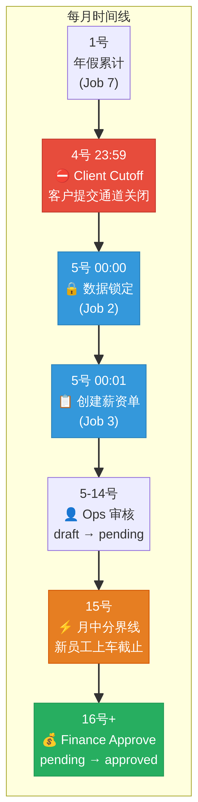
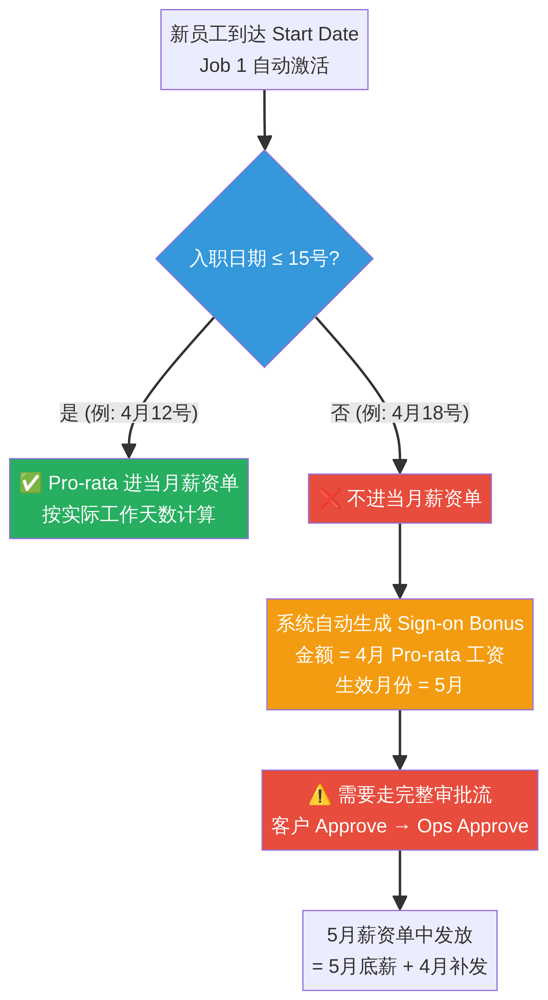
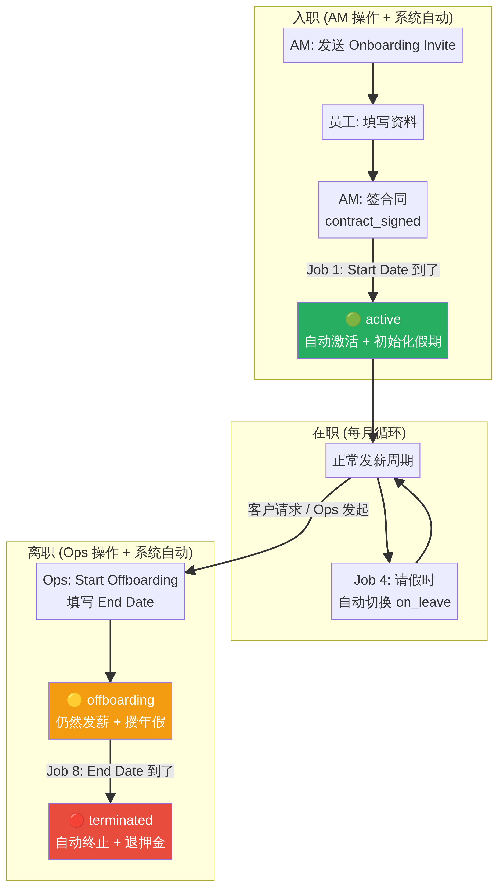

# GEA 平台运营手册 (Operations Playbook)

**版本:** 2.0 (包含 PR #63 员工全生命周期重构)  
**日期:** 2026年3月14日  
**适用对象:** AM (客户成功), Ops (运营), Finance (财务)  

> **导读：** 这不是一本干瘪的系统说明书，而是一本**实战避坑指南**。GEA 平台是一台精密的机器，每天凌晨都有定时任务（Cron Jobs）在后台默默处理数据。作为运营人员，你的核心任务不是手动录入每一条数据，而是**在正确的时间，把数据推入正确的状态，然后让系统接管**。本手册将带你从业务场景出发，看懂系统背后的自动化逻辑。

---

## 第一章：EOR 薪资周期 —— 守住时间的边界

薪资计算（Payroll）是 EOR 业务的心脏。在 GEA 平台中，每个月的薪资单（Payroll Run）由两部分构成：
1. **本月底薪**：根据员工本月在职天数计算出的基础工资（Base Salary / Pro-rata）。
2. **上月异动**：上个月内产生并被批准的各类异动（Adjustments / Leave / Reimbursements）。

为了准确抓取这两部分数据，系统设计了一条严格的时间线。作为 Ops 和 Finance，你们必须在这个时间线内完成接力，任何提前或延后的操作，都会导致员工少拿钱或公司合规违约。

### 每月时间线总览

### 1.1 每月 5 号的"发车"逻辑

**场景：** 4 月 5 号凌晨 00:01，系统（Job 3）准时为所有国家创建了 4 月份的薪资单（状态为 `draft`）。

**系统做了什么？**
1. 系统扫描了所有状态为 `active` 和 `offboarding`（离职交接中）的员工，把他们拉进 4 月薪资单。
2. 系统把 3 月份客户和 Ops 审批通过（`admin_approved`）的所有奖金、扣款、报销、请假数据，全部打上“已锁定”标签（`locked`），并塞进 4 月薪资单。

**Ops 必须知道的红线：**
- ⚠️ **绝对不要在 5 号之前手动创建薪资单！** 如果你在 4 号手动建了薪资单，它将无法抓取到 3 月份的锁定数据，员工这个月的报销和奖金就全丢了。
- **如果在 5 号之后发现漏了数据怎么办？** 如果客户在 6 号才想起来补发一笔 3 月的奖金，你可以利用 Admin 特权帮他补建。建完后，**必须让客户在 Portal 点击 Approve**，然后你再 Approve。最后，在 4 月的 `draft` 薪资单（Payroll Run）里点击 **Auto-fill**，这笔迟到的奖金就会被重新拉取进来。
- ⚠️ **极限卡点情况：** 如果客户在 4 号晚上 23:59 压线点击了 Approve，但 Ops（Admin）还没来得及 Approve，5 号 00:00 的自动锁定任务就不会抓取这条数据。这种情况下，Ops 必须在 5 号之后手动 Approve 这条数据（状态变为 `locked`），然后去当月的薪资单里点击 **Auto-fill** 将其强行拉入。

### 1.2 每月 15 号的"上车"分界线

**场景：** 张三在 4 月 12 号入职（Start Date），李四在 4 月 18 号入职。系统会怎么给他们发首月工资？

**系统做了什么？**
每天凌晨 00:01（Job 1），系统会检查有没有员工今天到达入职日期。
- 对于 12 号入职的**张三**：系统自动将他激活（`active`），并按实际工作天数计算出 Pro-rata（按比例）工资，直接塞进 4 月正在审核的 `draft` 薪资单里。
- 对于 18 号入职的**李四**：因为超过了 15 号这个月中分界线，系统激活他后，**不会**把他放进 4 月的薪资单（Payroll Run）。相反，系统会自动生成一笔名为 "Sign-on Bonus" 的异动（Adjustment），这笔钱等于他 4 月该拿的工资，且**生效月份（effectiveMonth）就是 4 月**。这样在 5 月 5 号生成 5 月薪资单时，系统会抓取 4 月锁定的异动，李四就能在 5 月的工资条里一次性拿到 4 月的补发和 5 月的底薪。

**Ops 与 Finance 的致命红线：**
- ⚠️ **绝对不要在 15 号之前将当月薪资单变更为 `approved`！** 
- 为什么？因为薪资单一旦被 Finance `approved`，就彻底锁死了。如果 Finance 在 10 号就手快点了 Approve，那么 12 号入职的张三，系统就再也无法把他塞进 4 月的薪资单里了，张三 4 月将拿不到一分钱！
- **正确节奏：** Ops 在 5-14 号期间审核数据，15 号确认没有新入职员工“上车”后，提交给 Finance，Finance 在 16 号之后进行最终 Approve。

---

## 第二章：员工全生命周期 —— 对称的入职与离职

从 PR #63 开始，GEA 平台实现了**对称的入职与离职自动化**。无论是 AM 还是 Ops，你们都不需要每天盯着日历去手动修改员工状态。

### 员工全生命周期总览

### 2.1 入职自动化 (Onboarding)

**场景：** AM 已经和客户确认好，王五将在 5 月 1 号入职。

**AM 的正确操作：**
1. 提醒**客户**在 Portal 发送 Onboarding Invite 给王五（注意：AM 只能在后台直接添加员工，发送邀请是客户的功能）。
2. 王五填完资料后，AM 生成合同并标记为 `contract_signed`，同时设定 Start Date 为 5 月 1 号。
3. **结束。AM 不需要做任何其他事。**

**系统接管：**
- 当员工状态变为 `onboarding` 时，系统会**立即触发生成一笔押金账单（Deposit Invoice）**给客户。
- 5 月 1 号凌晨 00:01（Job 1），系统自动将王五的状态从 `contract_signed` 变为 `active`。
- 此时，系统会自动初始化王五所在国家的假期政策（如无），并为他建立假期余额账户。

### 2.2 离职自动化 (Offboarding)

**场景：** 客户 HR 在 Portal 发起申请，说赵六要离职，最后工作日（End Date）是 5 月 20 号。

**Ops 的正确操作：**
1. 收到系统的通知邮件（Termination Request）。
2. 在 Admin Portal 找到赵六，点击 "Start Offboarding"。
3. **必须填写 End Date 为 5 月 20 号**，状态变更为 `offboarding`。
4. **结束。Ops 不需要等到 20 号去手动点终止。**

**系统接管与硬性规则：**

> 🔴 **硬规则 1：离职交接期必须发工资。** 赵六处于 `offboarding` 状态期间，系统依然会把他拉进当月的薪资单。  
> 🔴 **硬规则 2：离职交接期必须继续攒年假。** 每月 1 号的年假累计任务（Job 7），不仅会给 `active` 员工发年假，也会给 `offboarding` 员工发年假。

- **对称 Pro-rata：** 在 5 月的薪资单中，系统发现赵六的 End Date 是 5 月 20 号，会自动计算 1-20 号的 Pro-rata 工资，不会多发一分钱。
- **自动终止与押金退还：** 5 月 20 号凌晨 00:02（Job 8: Auto-Termination），系统发现赵六的 End Date 到了，自动将他从 `offboarding` 变为 `terminated`。
- **押金退还时机：** 只要员工状态变为 `terminated`（无论是 Job 8 自动触发，还是你手动点击 Terminate Now），系统都会立即触发**押金退还账单（Deposit Refund Invoice）**。退还账单（负数金额）生成后，金额会增加到客户的钱包余额中，或者退回到**冻结钱包（Frozen Wallet）**，后续需手动解冻并转移至可用钱包。

> ⚠️ **紧急情况下的 "Terminate Now"：** 只有在遇到员工严重违纪、当天被开除（End Date 就是今天或昨天）的情况下，Ops 才应该使用 "Terminate Now" 按钮直接跳过 `offboarding` 状态。常规离职必须走 `offboarding` 缓冲期。

---

## 第三章：AOR 承包商付款 —— 简单但不能错

相比于 EOR 复杂的本月/上月逻辑，AOR（承包商）的付款逻辑非常直接，但依然依赖每月的自动抓取。

### 3.1 三种计费模式的自动发票

**场景：** 客户雇佣了三个承包商，分别按月、半月、按项目（Milestone）计费。

每月 5 号 00:01，系统的 Job 3 会自动生成承包商发票（Contractor Invoices）：
1. **按月固定 (Fixed Monthly)**：系统直接生成 1 张全额发票。如果承包商上个月有报销（已 locked），一并塞进去。
2. **半月固定 (Semi-Monthly)**：系统会生成 2 张发票。一张是 1-15 号的半薪，一张是 16-月末的半薪（外加报销）。
3. **按项目 (Milestone)**：系统**不发固定底薪**。系统只去寻找那些已经被客户和 Ops 审批通过，并在 5 号被锁定的 Milestone，根据 Milestone 的金额生成发票。

**Ops 的注意事项：**
如果承包商抱怨没有收到 Milestone 的钱，Ops 第一步应该检查：这个 Milestone 在 4 号晚上 23:59 之前，客户点击 Approve 了吗？如果没有，它就不会在 5 号被锁定，也就不会生成发票。

### 3.2 承包商的终止

和全职员工一样，承包商现在也支持优雅终止。
当客户要求终止承包商时，Ops 点击 Terminate，**必须输入 End Date 和 Reason**。系统会记录审计日志，并在 End Date 到达后停止为其生成后续的固定发票。

---

## 第四章：各岗位避坑清单 (Checklists)

为了避免系统自动化报错，各团队在日常操作中请严格遵守以下清单。

### 4.1 AM 客户成功经理避坑清单

- [ ] **客户建档必填 Billing Entity**：在创建客户后，第一时间去 `Billing Entities` 标签页添加至少一个结算主体。没有这个，系统无法开具发票，整个流程会卡死。
- [ ] **入职邀请的薪资币种**：发送 Onboarding Invite 时，务必确认薪资币种与员工所在国家的法定货币一致。
- [ ] **合同签署要趁早**：如果员工要在下个月初入职，尽量在当月月底前把状态推到 `contract_signed`，确保 1 号凌晨系统能顺利抓取激活。

### 4.2 Ops 运营专员避坑清单

- [ ] **15号之前管住手**：每月 15 号之前，绝对不要把任何 `draft` 薪资单变成 `approved`。
- [ ] **三大项补录要客户点头**：如果你用 Admin 权限帮客户补录了数据，必须发邮件/消息提醒客户去 Portal 里点击 Approve。系统只认客户的点击，不认你的口头确认。
- [ ] **不要手动改 locked 数据**：如果发现 `locked` 的数据错了，不要去改原数据。去薪资单里用 Add Item / Delete Item 来冲平。
- [ ] **注意请假状态 (on_leave)**：系统在每天 00:02 会自动将请假中的员工状态改为 `on_leave`。如果员工在 5 号当天处于 `on_leave` 状态，他可能不会被自动拉入薪资单，你需要特别留意这些员工并手动处理。
- [ ] **离职必须填 End Date**：点 "Start Offboarding" 时，End Date 是决定他最后拿多少钱的唯一标准，填错一天都会导致薪资计算错误。

### 4.3 Finance 财务专员避坑清单

- [ ] **薪资单审批不要拖**：每月 16-18 号必须完成所有薪资单的 Approve。一旦拖延，客户发票就发不出去，收款就会延期。
- [ ] **线下打款及时核销**：系统每天凌晨会扫描逾期发票（Job 5）。如果客户私下给你转了账，你必须当天在系统里把发票标为 `paid`。否则明天客户就会收到催款邮件，引发投诉。
- [ ] **退款账单与钱包余额**：系统已经取消了 Credit Note 抵扣账单的概念，全面引入了**钱包（Wallet）**。员工离职生成的 Deposit Refund 会增加客户的钱包余额，客户在支付下个月的账单时，可以直接使用 Wallet 余额进行支付（Invoice Deduction）。财务需注意核对钱包流水（Wallet Transactions）。

---

## 附录：自动化任务与状态机速查

> 遇到问题时，用来排查系统在后台到底干了什么。

### 附录 A：八大定时任务 (Cron Jobs)
*所有任务都在 Admin Portal -> Settings -> Scheduled Jobs 中可查可控。*

1. **Job 1 (Employee Auto-Activation)**: 每天 00:01。把到了 Start Date 的 `contract_signed` 员工变成 `active`。处理 15 号的 Pro-rata 和 Sign-on Bonus 逻辑。
2. **Job 2 (Auto-Lock Data)**: 每月 5 号 00:00。把上个月所有 `admin_approved` 的三大项和承包商里程碑全部变成 `locked`。
3. **Job 3 (Auto-Create Payroll Runs)**: 每月 5 号 00:01。建薪资单，抓取刚刚被 Job 2 变成 `locked` 的数据，算钱。生成承包商发票。（注意 Job 2 和 Job 3 这 1 分钟的先后顺序是核心设计）
4. **Job 4 (Leave Status Transition)**: 每天 00:02。根据请假单日期，自动在 `active` 和 `on_leave` 之间切换员工状态。
5. **Job 5 (Overdue Invoice Detection)**: 每天 00:03。把过了 Due Date 的发票标为 `overdue` 并发催款邮件。
6. **Job 6 (Exchange Rate Fetch)**: 每天 00:05。去 ExchangeRate-API 抓取最新汇率。
7. **Job 7 (Monthly Leave Accrual)**: 每月 1 号 00:10。给当年入职的员工（包括 `active` 和 `offboarding`）发年假，每月发 1/12。
8. **Job 8 (Employee Auto-Termination)**: 每天 00:02。把到了 End Date 的 `offboarding` 员工变成 `terminated`。

### 附录 B：核心状态机流转

**1. 员工状态 (Employee)**
`pending_review` (AM建档) → `documents_incomplete` (员工填资料) → `onboarding` (AM审核) → `contract_signed` (合同签署) → `active` (Job 1激活) → `offboarding` (Ops发起离职) → `terminated` (Job 8终止)

**2. 三大项状态 (Adjustments/Leave/Reimbursements)**
`submitted` (提交) → `client_approved` (客户点头) → `admin_approved` (Ops点头) → `locked` (Job 2锁定，进入发薪)

**3. 薪资单状态 (Payroll Run)**
`draft` (Job 3生成，Ops可改) → `pending_approval` (Ops提交) → `approved` (Finance定稿，锁死)

**4. 客户发票状态 (Invoice)**
`draft` (草稿) → `pending_review` (内部复核) → `sent` (已发客户) → `paid` (客户给钱了) 或 `overdue` (Job 5发现没给钱)
