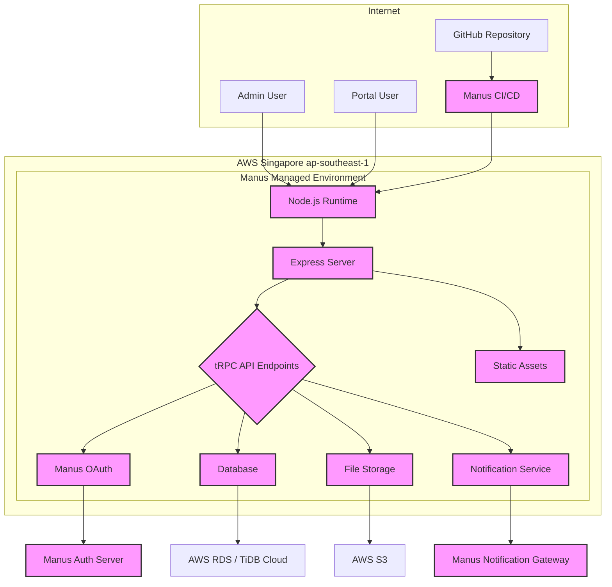

# GEA EOR SaaS Admin 部署文档

> **版本**: 2.0
> **更新日期**: 2026-02-28

## 1. 概述

本文档详细说明了 **GEA EOR SaaS Admin** 系统如何通过 **Manus** 平台托管和部署在 **AWS 新加坡 (ap-southeast-1)** 节点。系统利用 Manus 提供的自动化基础设施、持续集成与持续部署 (CI/CD) 以及内置的云服务，实现了高效、安全、可扩展的部署架构。

## 2. 部署架构

系统采用前后端分离的单体仓库 (Monorepo) 架构，通过 Manus 的标准 Node.js 运行时环境进行部署。整体架构如下图所示：

### 2.1 核心组件

| 组件 | 技术实现 | 描述 |
| :--- | :--- | :--- |
| **运行时环境** | Node.js (v22.x) | 由 Manus 平台提供和管理的标准 Node.js 容器化环境。 |
| **Web 服务器** | Express.js | 运行在 Node.js 环境中，处理所有传入的 HTTP 请求。 |
| **API** | tRPC | 提供类型安全的 API 端点，分为管理后台 (`/api/trpc`) 和客户门户 (`/api/portal`)。 |
| **前端** | React (Vite) | 编译后的静态资源 (HTML, CSS, JS) 由 Express.js 托管。 |
| **数据库** | MySQL 兼容数据库 | Manus 平台自动配置并注入 `DATABASE_URL`，通常为 AWS RDS 或 TiDB Cloud。 |
| **文件存储** | AWS S3 | 用于存储用户上传的文件，如合同、凭证等。通过 Manus Forge API 进行访问。 |
| **身份认证** | Manus OAuth & JWT | 管理后台使用 Manus OAuth，客户门户使用独立的 JWT 认证。 |

## 3. CI/CD 流程

部署流程完全自动化，由 Manus CI/CD 流水线驱动，该流水线在代码推送到指定分支（例如 `main`）时触发。

1.  **触发构建**: 开发者将代码推送到 GitHub 仓库。
2.  **检出代码**: Manus CI/CD 从仓库中检出最新代码。
3.  **安装依赖**: 执行 `pnpm install` 安装所有项目依赖。
4.  **构建项目**: 执行 `pnpm run build` 命令，该命令包含两个步骤：
    *   `vite build`: 将 `client/` 目录下的前端 React 代码编译打包成静态文件，输出到 `dist/public`。
    *   `esbuild`: 将 `server/` 目录下的后端 TypeScript 代码编译打包成单一的 JavaScript 文件，输出到 `dist/index.js`。
5.  **部署应用**: Manus 平台将 `dist/` 目录下的构建产物部署到 AWS 新加坡节点的 Node.js 运行时环境中。
6.  **启动服务**: 部署完成后，通过 `pnpm run start` (即 `node dist/index.js`) 命令启动 Express 服务器。

## 4. 环境变量配置

系统通过环境变量进行配置，这些变量由 Manus 平台在部署时自动注入到运行时环境中，无需手动管理。

| 环境变量 | 来源 | 用途 |
| :--- | :--- | :--- |
| `PORT` | Manus 平台 | 指定 Express 服务器监听的端口。 |
| `DATABASE_URL` | Manus 平台 | MySQL 数据库的连接字符串。 |
| `JWT_SECRET` | Manus 平台 (Secrets) | 用于签署客户门户 JWT 的密钥。 |
| `OAUTH_SERVER_URL` | Manus 平台 | Manus OAuth 认证服务器的地址。 |
| `OWNER_OPEN_ID` | Manus 平台 (Secrets) | 拥有初始管理员权限的用户的 OpenID。 |
| `BUILT_IN_FORGE_API_URL` | Manus 平台 | Manus 内置服务 (Forge) 的 API 地址，用于存储和通知。 |
| `BUILT_IN_FORGE_API_KEY` | Manus 平台 (Secrets) | 访问 Manus Forge API 的密钥。 |

## 5. 核心服务集成

系统深度集成了 Manus 平台提供的多项托管服务，以简化开发和运维。

### 5.1 身份认证 (Authentication)

系统包含两套完全独立的认证机制：

*   **管理后台**: 通过 `server/_core/sdk.ts` 与 Manus OAuth 服务集成。用户登录时重定向到 Manus 的统一登录页面，认证成功后通过回调 (`/api/oauth/callback`) 获取用户信息并创建会话。会话信息通过加密的 HTTP-Only Cookie (`app_session_id`) 进行维护。

*   **客户门户**: 采用传统的邮箱/密码认证，后端逻辑位于 `server/portal/portalAuth.ts`。用户密码使用 `bcrypt` 哈希存储，会话通过独立的 JWT (`portal_session` Cookie) 进行管理。JWT 使用与管理后台不同的密钥和签发者 (Issuer)，确保了令牌的隔离性。

### 5.2 数据库 (Database)

项目使用 Drizzle ORM 与 MySQL 兼容数据库进行交互。数据库实例由 Manus 在 AWS 上自动创建和管理，并通过 `DATABASE_URL` 环境变量将连接信息提供给应用程序。Drizzle Kit 用于在本地开发和 CI/CD 流程中管理数据库模式的迁移。

### 5.3 文件存储 (File Storage)

所有文件（如员工合同、报销凭证、公司 Logo）都存储在 AWS S3 中。应用本身不直接处理 AWS 凭证，而是通过调用 Manus Forge API (`BUILT_IN_FORGE_API_URL`) 来获取预签名的 S3 URL，实现安全的文件上传和下载。这种方式将存储逻辑与应用代码解耦，并统一了凭证管理。

### 5.4 定时任务 (Cron Jobs)

系统包含多个关键的后台定时任务，定义在 `server/cronJobs.ts` 中，使用 `node-cron` 库进行调度。所有任务均以**亚洲/上海**时区 (`Asia/Shanghai`) 为基准执行。

| 任务 | Cron 表达式 | 执行时间 (北京时间) | 描述 |
| :--- | :--- | :--- | :--- |
| 员工自动激活 | `0 1 0 * * *` | 每日 00:01 | 将合同已签署且入职日期已到的员工状态从未激活更新为“活跃”。 |
| 假期状态转换 | `0 2 0 * * *` | 每日 00:02 | 根据假期记录自动将员工状态在“活跃”和“休假中”之间转换。 |
| 发票逾期检测 | `0 3 0 * * *` | 每日 00:03 | 将已发送但超过付款期限的发票状态更新为“逾期”。 |
| 汇率自动获取 | `0 5 0 * * *` | 每日 00:05 | 从 `ExchangeRate-API` 或 `Frankfurter API` 获取最新汇率并存入数据库。 |
| 月度数据锁定 | `0 0 0 5 * *` | 每月 5 日 00:00 | 自动锁定上一个月的异动薪酬和假期记录，使其不可再修改。 |
| 薪酬批次创建 | `0 1 0 5 * *` | 每月 5 日 00:01 | 为所有有活跃员工的国家自动创建当月的薪酬批次草稿。 |

## 6. 监控与日志

*   **应用日志**: 所有 `console.log` 和 `console.error` 的输出都会被 Manus 平台捕获，并可在项目控制台中查看。
*   **访问日志**: Manus 自动记录所有指向应用服务器的 HTTP 请求日志。
*   **审计日志**: 应用层面，所有关键的写操作（如创建客户、更新发票状态）都会在 `audit_logs` 数据表中创建一条记录，详细追踪了操作人、时间、IP 地址和变更内容。
*   **前端调试**: 在开发环境中，通过自定义的 Vite 插件 (`vitePluginManusDebugCollector`)，浏览器端的控制台日志和网络请求会被发送到后端并写入本地 `.manus-logs` 目录，便于调试。
